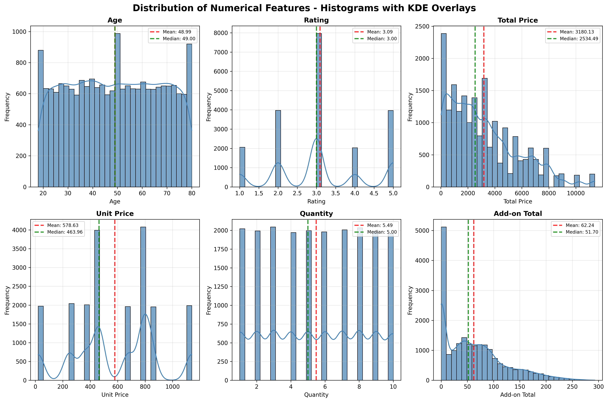
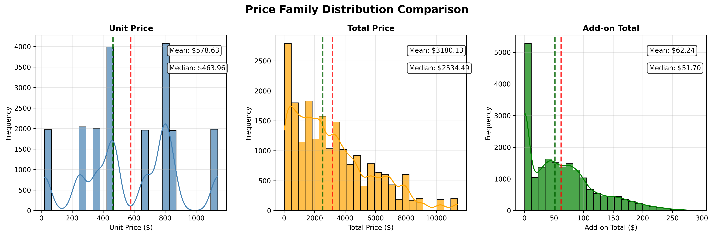
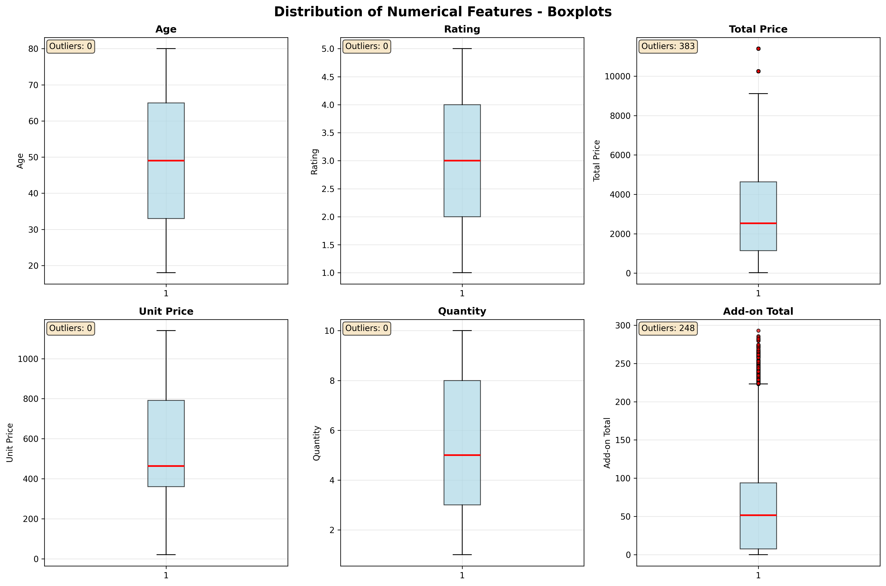
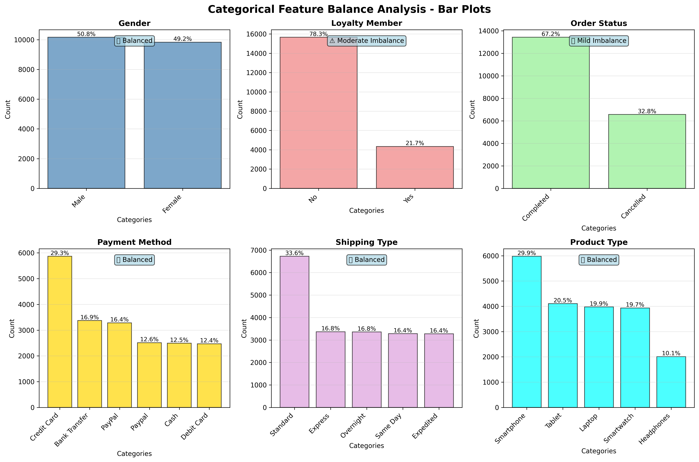
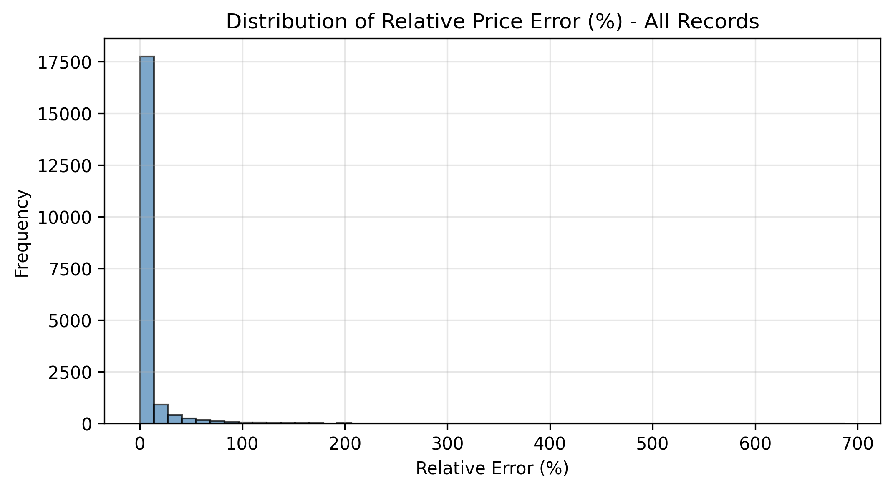
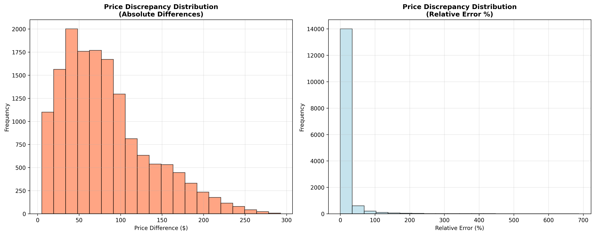
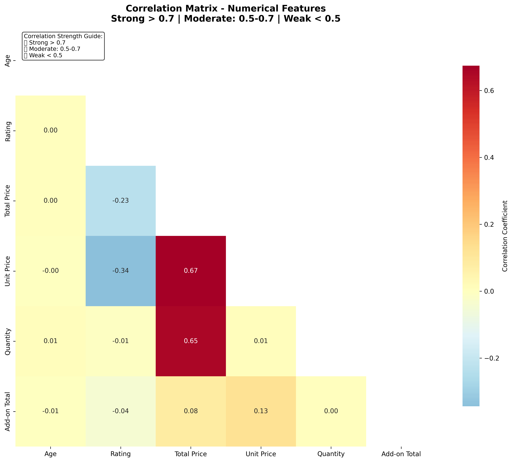
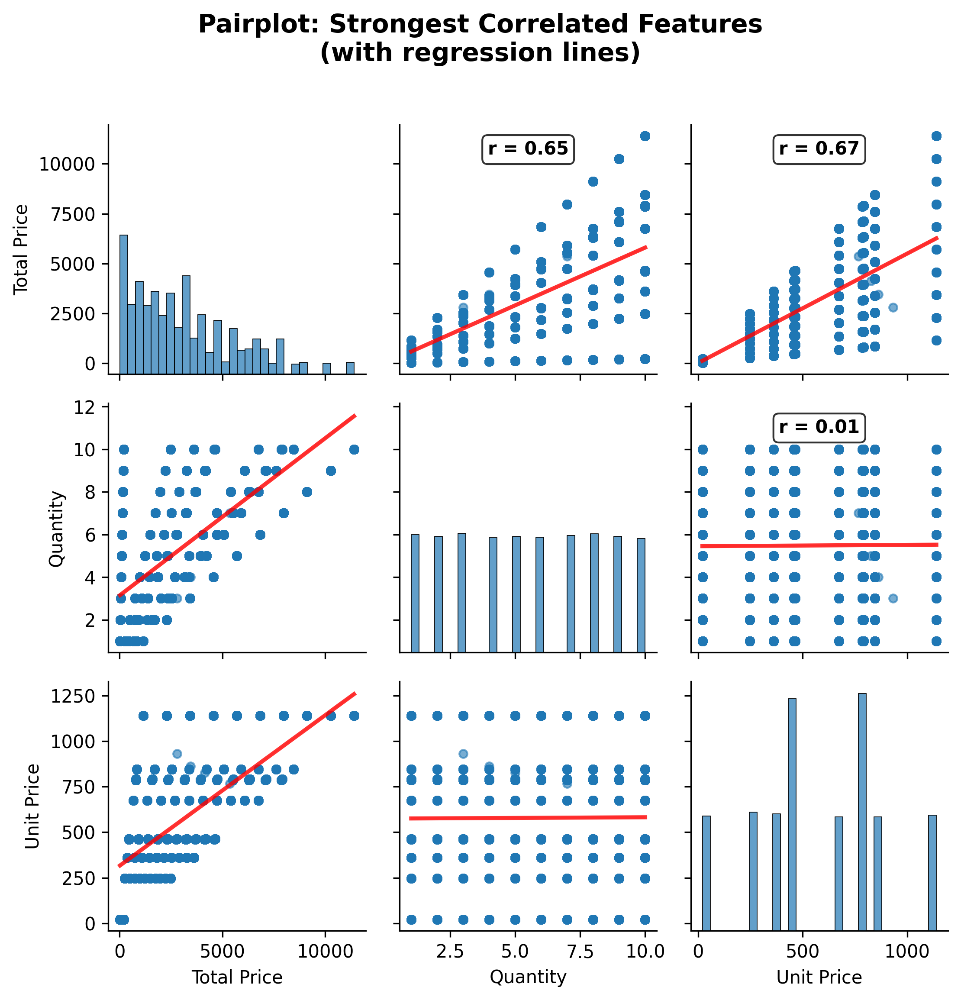

```python
# Import required libraries
import pandas as pd
import numpy as np
import matplotlib.pyplot as plt
import seaborn as sns
from scipy import stats
from datetime import datetime
import warnings
warnings.filterwarnings('ignore')

# Set display options for better output
pd.set_option('display.max_columns', None)
pd.set_option('display.width', None)
pd.set_option('display.max_colwidth', 50)
pd.set_option('display.float_format', '{:.3f}'.format)

print("✅ Libraries imported successfully!")
print(f"📅 Analysis started on: {datetime.now().strftime('%Y-%m-%d %H:%M:%S')}")
```

    ✅ Libraries imported successfully!
    📅 Analysis started on: 2025-10-09 00:17:17
    


```python
# Setup figure saving configuration for Phase 2
import os
from pathlib import Path

# Create figure directories if they don't exist
FIGURE_DIR = Path("../../outputs/figures")
FIGURE_SUBDIRS = {
    'distributions': FIGURE_DIR / 'distributions',
    'statistics': FIGURE_DIR / 'statistics',
    'correlations': FIGURE_DIR / 'correlations',
    'outliers': FIGURE_DIR / 'outliers'
}

# Create all directories
for subdir_name, subdir_path in FIGURE_SUBDIRS.items():
    subdir_path.mkdir(parents=True, exist_ok=True)

# Configure matplotlib for high-quality figure saving
plt.rcParams['figure.dpi'] = 300
plt.rcParams['savefig.dpi'] = 300
plt.rcParams['savefig.format'] = 'png'
plt.rcParams['savefig.bbox'] = 'tight'
plt.rcParams['figure.figsize'] = (10, 6)

# Helper function to save figures
def save_figure(fig, filename, category='distributions', formats=['png']):
    """Save figure to appropriate directory with multiple formats"""
    save_dir = FIGURE_SUBDIRS[category]
    
    for fmt in formats:
        filepath = save_dir / f"{filename}.{fmt}"
        fig.savefig(filepath, format=fmt, dpi=300, bbox_inches='tight')
        print(f"💾 Saved: figures/{category}/{filename}.{fmt}")

print("✅ Figure saving configuration complete!")
print(f"📊 Figures will be saved to: {FIGURE_DIR.absolute()}")
```

    ✅ Figure saving configuration complete!
    📊 Figures will be saved to: c:\Users\hatim\OneDrive\سطح المكتب\iau\25.26\Data_Mining\Project\DataMining\notebooks\expalortation\..\..\outputs\figures
    


```python
# Load the cleaned dataset from Phase 1
try:
    # Load the dataset
    data_path = "../../data/raw/Electronic_sales_Sep2023-Sep2024.csv"
    df = pd.read_csv(data_path)
    
    # Convert Purchase Date to datetime (from Phase 1)
    df['Purchase Date'] = pd.to_datetime(df['Purchase Date'], format='%Y-%m-%d')
    
    print("✅ Data loaded successfully!")
    print(f"📊 Dataset shape: {df.shape}")
    print(f"📅 Date range: {df['Purchase Date'].min()} to {df['Purchase Date'].max()}")
    
except Exception as e:
    print(f"❌ Error loading data: {e}")
    print("Please ensure Phase 1 (data loading) has been completed first.")
```

    ✅ Data loaded successfully!
    📊 Dataset shape: (20000, 16)
    📅 Date range: 2023-09-24 00:00:00 to 2024-09-23 00:00:00
    

## 🔢 Step 2.1: Identify Numerical Columns
**Goal**: Detect which features are numeric for statistical analysis


```python
# Step 2.1: Identify numerical columns
print("✅ Step 2.1 COMPLETED: Numerical Column Identification")
print("=" * 70)

# Get numerical columns
numeric_cols = df.select_dtypes(include=[np.number]).columns.tolist()
categorical_cols = df.select_dtypes(include=['object']).columns.tolist()
datetime_cols = df.select_dtypes(include=['datetime']).columns.tolist()

print(f"📊 NUMERICAL COLUMNS ({len(numeric_cols)}):")
for i, col in enumerate(numeric_cols, 1):
    data_range = f"{df[col].min():.2f} to {df[col].max():.2f}"
    print(f"   {i}. {col} ({df[col].dtype}) - Range: {data_range}")

print(f"\n🏷️  CATEGORICAL COLUMNS ({len(categorical_cols)}):")
for i, col in enumerate(categorical_cols, 1):
    unique_count = df[col].nunique()
    print(f"   {i}. {col} - {unique_count} unique values")

print(f"\n📅 DATETIME COLUMNS ({len(datetime_cols)}):")
for i, col in enumerate(datetime_cols, 1):
    date_range = f"{df[col].min().strftime('%Y-%m-%d')} to {df[col].max().strftime('%Y-%m-%d')}"
    print(f"   {i}. {col} - Range: {date_range}")

# Store for later use
print(f"\n📋 ANALYSIS FOCUS:")
print(f"   • Will analyze {len(numeric_cols)} numerical features in detail")
print(f"   • Expected columns: Customer ID, Age, Rating, Total Price, Unit Price, Quantity, Add-on Total")

# Verify expected columns are present
expected_numeric = ['Customer ID', 'Age', 'Rating', 'Total Price', 'Unit Price', 'Quantity', 'Add-on Total']
missing_expected = [col for col in expected_numeric if col not in numeric_cols]
if missing_expected:
    print(f"⚠️  Missing expected columns: {missing_expected}")
else:
    print("✅ All expected numerical columns found!")
```

    ✅ Step 2.1 COMPLETED: Numerical Column Identification
    ======================================================================
    📊 NUMERICAL COLUMNS (7):
       1. Customer ID (int64) - Range: 1000.00 to 19998.00
       2. Age (int64) - Range: 18.00 to 80.00
       3. Rating (int64) - Range: 1.00 to 5.00
       4. Total Price (float64) - Range: 20.75 to 11396.80
       5. Unit Price (float64) - Range: 20.75 to 1139.68
       6. Quantity (int64) - Range: 1.00 to 10.00
       7. Add-on Total (float64) - Range: 0.00 to 292.77
    
    🏷️  CATEGORICAL COLUMNS (8):
       1. Gender - 2 unique values
       2. Loyalty Member - 2 unique values
       3. Product Type - 5 unique values
       4. SKU - 10 unique values
       5. Order Status - 2 unique values
       6. Payment Method - 6 unique values
       7. Shipping Type - 5 unique values
       8. Add-ons Purchased - 75 unique values
    
    📅 DATETIME COLUMNS (1):
       1. Purchase Date - Range: 2023-09-24 to 2024-09-23
    
    📋 ANALYSIS FOCUS:
       • Will analyze 7 numerical features in detail
       • Expected columns: Customer ID, Age, Rating, Total Price, Unit Price, Quantity, Add-on Total
    ✅ All expected numerical columns found!
    

## 📈 Step 2.2: Compute Basic Statistics
**Goal**: Get comprehensive statistical summary (mean, median, std, quartiles, etc.)


```python
# Step 2.2: Compute basic statistics
print("✅ Step 2.2 COMPLETED: Basic Statistical Summary")
print("=" * 70)

# Standard describe() - shows count, mean, std, min, quartiles, max
print("📊 STANDARD DESCRIPTIVE STATISTICS:")
# Exclude Customer ID from statistical analysis (it's an identifier, not a variable)
analysis_cols = [col for col in numeric_cols if col != 'Customer ID']
basic_stats = df[analysis_cols].describe()
display(basic_stats)

# Enhanced statistics with additional metrics
print("\n📋 ENHANCED STATISTICAL SUMMARY:")
enhanced_stats = df[analysis_cols].agg([
    'count', 'mean', 'median', 'std', 'min', 'max', 
    'var',  # variance
    lambda x: x.quantile(0.25),  # Q1
    lambda x: x.quantile(0.75),  # Q3
    lambda x: x.max() - x.min(), # range
    lambda x: (x.std() / x.mean() * 100) if x.mean() != 0 else 0  # coefficient of variation (%)
]).round(3)

# Rename the lambda functions for clarity
enhanced_stats.index = ['Count', 'Mean', 'Median', 'Std Dev', 'Min', 'Max', 
                       'Variance', 'Q1', 'Q3', 'Range', 'CV (%)']

display(enhanced_stats.T)

# Key insights from basic statistics
print("\n🔍 KEY STATISTICAL INSIGHTS:")

for col in analysis_cols:
        
    mean_val = df[col].mean()
    median_val = df[col].median()
    std_val = df[col].std()
    cv = (std_val / mean_val * 100) if mean_val != 0 else 0
    
    print(f"\n   📊 {col}:")
    print(f"      • Average: {mean_val:.2f} | Median: {median_val:.2f}")
    print(f"      • Standard Deviation: {std_val:.2f}")
    print(f"      • Coefficient of Variation: {cv:.1f}% ({'High variability' if cv > 50 else 'Moderate variability' if cv > 20 else 'Low variability'})")
    
    # Check for potential issues
    if mean_val > median_val * 1.2:
        print(f"      ⚠️  Right-skewed distribution (mean > median)")
    elif mean_val < median_val * 0.8:
        print(f"      ⚠️  Left-skewed distribution (mean < median)")
    else:
        print(f"      ✅ Approximately symmetric distribution")
```

    ✅ Step 2.2 COMPLETED: Basic Statistical Summary
    ======================================================================
    📊 STANDARD DESCRIPTIVE STATISTICS:
    


<div>
<style scoped>
    .dataframe tbody tr th:only-of-type {
        vertical-align: middle;
    }

    .dataframe tbody tr th {
        vertical-align: top;
    }

    .dataframe thead th {
        text-align: right;
    }
</style>
<table border="1" class="dataframe">
  <thead>
    <tr style="text-align: right;">
      <th></th>
      <th>Age</th>
      <th>Rating</th>
      <th>Total Price</th>
      <th>Unit Price</th>
      <th>Quantity</th>
      <th>Add-on Total</th>
    </tr>
  </thead>
  <tbody>
    <tr>
      <th>count</th>
      <td>20000.000</td>
      <td>20000.000</td>
      <td>20000.000</td>
      <td>20000.000</td>
      <td>20000.000</td>
      <td>20000.000</td>
    </tr>
    <tr>
      <th>mean</th>
      <td>48.994</td>
      <td>3.094</td>
      <td>3180.133</td>
      <td>578.632</td>
      <td>5.486</td>
      <td>62.245</td>
    </tr>
    <tr>
      <th>std</th>
      <td>18.039</td>
      <td>1.224</td>
      <td>2544.979</td>
      <td>312.274</td>
      <td>2.871</td>
      <td>58.058</td>
    </tr>
    <tr>
      <th>min</th>
      <td>18.000</td>
      <td>1.000</td>
      <td>20.750</td>
      <td>20.750</td>
      <td>1.000</td>
      <td>0.000</td>
    </tr>
    <tr>
      <th>25%</th>
      <td>33.000</td>
      <td>2.000</td>
      <td>1139.680</td>
      <td>361.180</td>
      <td>3.000</td>
      <td>7.615</td>
    </tr>
    <tr>
      <th>50%</th>
      <td>49.000</td>
      <td>3.000</td>
      <td>2534.490</td>
      <td>463.960</td>
      <td>5.000</td>
      <td>51.700</td>
    </tr>
    <tr>
      <th>75%</th>
      <td>65.000</td>
      <td>4.000</td>
      <td>4639.600</td>
      <td>791.190</td>
      <td>8.000</td>
      <td>93.843</td>
    </tr>
    <tr>
      <th>max</th>
      <td>80.000</td>
      <td>5.000</td>
      <td>11396.800</td>
      <td>1139.680</td>
      <td>10.000</td>
      <td>292.770</td>
    </tr>
  </tbody>
</table>
</div>


    
    📋 ENHANCED STATISTICAL SUMMARY:
    


<div>
<style scoped>
    .dataframe tbody tr th:only-of-type {
        vertical-align: middle;
    }

    .dataframe tbody tr th {
        vertical-align: top;
    }

    .dataframe thead th {
        text-align: right;
    }
</style>
<table border="1" class="dataframe">
  <thead>
    <tr style="text-align: right;">
      <th></th>
      <th>Count</th>
      <th>Mean</th>
      <th>Median</th>
      <th>Std Dev</th>
      <th>Min</th>
      <th>Max</th>
      <th>Variance</th>
      <th>Q1</th>
      <th>Q3</th>
      <th>Range</th>
      <th>CV (%)</th>
    </tr>
  </thead>
  <tbody>
    <tr>
      <th>Age</th>
      <td>20000.000</td>
      <td>48.994</td>
      <td>49.000</td>
      <td>18.039</td>
      <td>18.000</td>
      <td>80.000</td>
      <td>325.396</td>
      <td>33.000</td>
      <td>65.000</td>
      <td>62.000</td>
      <td>36.818</td>
    </tr>
    <tr>
      <th>Rating</th>
      <td>20000.000</td>
      <td>3.094</td>
      <td>3.000</td>
      <td>1.224</td>
      <td>1.000</td>
      <td>5.000</td>
      <td>1.498</td>
      <td>2.000</td>
      <td>4.000</td>
      <td>4.000</td>
      <td>39.553</td>
    </tr>
    <tr>
      <th>Total Price</th>
      <td>20000.000</td>
      <td>3180.133</td>
      <td>2534.490</td>
      <td>2544.979</td>
      <td>20.750</td>
      <td>11396.800</td>
      <td>6476916.456</td>
      <td>1139.680</td>
      <td>4639.600</td>
      <td>11376.050</td>
      <td>80.027</td>
    </tr>
    <tr>
      <th>Unit Price</th>
      <td>20000.000</td>
      <td>578.632</td>
      <td>463.960</td>
      <td>312.274</td>
      <td>20.750</td>
      <td>1139.680</td>
      <td>97515.099</td>
      <td>361.180</td>
      <td>791.190</td>
      <td>1118.930</td>
      <td>53.968</td>
    </tr>
    <tr>
      <th>Quantity</th>
      <td>20000.000</td>
      <td>5.486</td>
      <td>5.000</td>
      <td>2.871</td>
      <td>1.000</td>
      <td>10.000</td>
      <td>8.242</td>
      <td>3.000</td>
      <td>8.000</td>
      <td>9.000</td>
      <td>52.335</td>
    </tr>
    <tr>
      <th>Add-on Total</th>
      <td>20000.000</td>
      <td>62.245</td>
      <td>51.700</td>
      <td>58.058</td>
      <td>0.000</td>
      <td>292.770</td>
      <td>3370.781</td>
      <td>7.615</td>
      <td>93.842</td>
      <td>292.770</td>
      <td>93.274</td>
    </tr>
  </tbody>
</table>
</div>


    
    🔍 KEY STATISTICAL INSIGHTS:
    
       📊 Age:
          • Average: 48.99 | Median: 49.00
          • Standard Deviation: 18.04
          • Coefficient of Variation: 36.8% (Moderate variability)
          ✅ Approximately symmetric distribution
    
       📊 Rating:
          • Average: 3.09 | Median: 3.00
          • Standard Deviation: 1.22
          • Coefficient of Variation: 39.6% (Moderate variability)
          ✅ Approximately symmetric distribution
    
       📊 Total Price:
          • Average: 3180.13 | Median: 2534.49
          • Standard Deviation: 2544.98
          • Coefficient of Variation: 80.0% (High variability)
          ⚠️  Right-skewed distribution (mean > median)
    
       📊 Unit Price:
          • Average: 578.63 | Median: 463.96
          • Standard Deviation: 312.27
          • Coefficient of Variation: 54.0% (High variability)
          ⚠️  Right-skewed distribution (mean > median)
    
       📊 Quantity:
          • Average: 5.49 | Median: 5.00
          • Standard Deviation: 2.87
          • Coefficient of Variation: 52.3% (High variability)
          ✅ Approximately symmetric distribution
    
       📊 Add-on Total:
          • Average: 62.24 | Median: 51.70
          • Standard Deviation: 58.06
          • Coefficient of Variation: 93.3% (High variability)
          ⚠️  Right-skewed distribution (mean > median)
    

## 📏 Step 2.3: Analyze Distribution Shape
**Goal**: Check skewness and kurtosis to understand distribution characteristics


```python
# Step 2.3: Analyze distribution shape (skewness & kurtosis)
print("✅ Step 2.3 COMPLETED: Distribution Shape Analysis")
print("=" * 70)

# Calculate skewness and kurtosis for all numeric columns
shape_stats = pd.DataFrame({
    'Mean': df[numeric_cols].mean(),
    'Median': df[numeric_cols].median(),
    'Std_Dev': df[numeric_cols].std(),
    'Skewness': df[numeric_cols].skew(),
    'Kurtosis': df[numeric_cols].kurt(),
}).round(3)

print("📊 DISTRIBUTION SHAPE METRICS:")
display(shape_stats)

print("\n🔍 DISTRIBUTION INTERPRETATION:")

for col in numeric_cols:
    if col == 'Customer ID':  # Skip Customer ID
        continue
        
    skew_val = df[col].skew()
    kurt_val = df[col].kurtosis()
    
    print(f"\n   📈 {col}:")
    
    # Skewness interpretation
    if abs(skew_val) < 0.5:
        skew_desc = "Approximately symmetric"
        skew_icon = "✅"
    elif skew_val > 0.5:
        if skew_val > 1:
            skew_desc = "Highly right-skewed (long tail to the right)"
            skew_icon = "⚠️"
        else:
            skew_desc = "Moderately right-skewed"
            skew_icon = "🔶"
    else:  # skew_val < -0.5
        if skew_val < -1:
            skew_desc = "Highly left-skewed (long tail to the left)"
            skew_icon = "⚠️"
        else:
            skew_desc = "Moderately left-skewed"
            skew_icon = "🔶"
    
    print(f"      • Skewness: {skew_val:.3f} {skew_icon} {skew_desc}")
    
    # Kurtosis interpretation
    if abs(kurt_val) < 0.5:
        kurt_desc = "Normal tail thickness"
        kurt_icon = "✅"
    elif kurt_val > 0.5:
        if kurt_val > 3:
            kurt_desc = "Very heavy tails (many outliers expected)"
            kurt_icon = "⚠️"
        else:
            kurt_desc = "Moderately heavy tails"
            kurt_icon = "🔶"
    else:  # kurt_val < -0.5
        kurt_desc = "Light tails (fewer outliers)"
        kurt_icon = "📉"
    
    print(f"      • Kurtosis: {kurt_val:.3f} {kurt_icon} {kurt_desc}")

# Summary of transformation needs
print(f"\n💡 TRANSFORMATION RECOMMENDATIONS:")
high_skew_cols = [col for col in numeric_cols if abs(df[col].skew()) > 1 and col != 'Customer ID']
moderate_skew_cols = [col for col in numeric_cols if 0.5 < abs(df[col].skew()) <= 1 and col != 'Customer ID']

if high_skew_cols:
    print(f"   🔴 High skewness (consider log/sqrt transformation): {high_skew_cols}")
if moderate_skew_cols:
    print(f"   🟡 Moderate skewness (monitor during modeling): {moderate_skew_cols}")
if not high_skew_cols and not moderate_skew_cols:
    print(f"   ✅ All distributions are reasonably symmetric")
```

    ✅ Step 2.3 COMPLETED: Distribution Shape Analysis
    ======================================================================
    📊 DISTRIBUTION SHAPE METRICS:
    


<div>
<style scoped>
    .dataframe tbody tr th:only-of-type {
        vertical-align: middle;
    }

    .dataframe tbody tr th {
        vertical-align: top;
    }

    .dataframe thead th {
        text-align: right;
    }
</style>
<table border="1" class="dataframe">
  <thead>
    <tr style="text-align: right;">
      <th></th>
      <th>Mean</th>
      <th>Median</th>
      <th>Std_Dev</th>
      <th>Skewness</th>
      <th>Kurtosis</th>
    </tr>
  </thead>
  <tbody>
    <tr>
      <th>Customer ID</th>
      <td>10483.527</td>
      <td>10499.500</td>
      <td>5631.733</td>
      <td>0.005</td>
      <td>-1.288</td>
    </tr>
    <tr>
      <th>Age</th>
      <td>48.994</td>
      <td>49.000</td>
      <td>18.039</td>
      <td>0.003</td>
      <td>-1.192</td>
    </tr>
    <tr>
      <th>Rating</th>
      <td>3.094</td>
      <td>3.000</td>
      <td>1.224</td>
      <td>0.133</td>
      <td>-0.791</td>
    </tr>
    <tr>
      <th>Total Price</th>
      <td>3180.133</td>
      <td>2534.490</td>
      <td>2544.979</td>
      <td>0.904</td>
      <td>0.289</td>
    </tr>
    <tr>
      <th>Unit Price</th>
      <td>578.632</td>
      <td>463.960</td>
      <td>312.274</td>
      <td>-0.027</td>
      <td>-0.708</td>
    </tr>
    <tr>
      <th>Quantity</th>
      <td>5.486</td>
      <td>5.000</td>
      <td>2.871</td>
      <td>0.002</td>
      <td>-1.227</td>
    </tr>
    <tr>
      <th>Add-on Total</th>
      <td>62.245</td>
      <td>51.700</td>
      <td>58.058</td>
      <td>0.937</td>
      <td>0.393</td>
    </tr>
  </tbody>
</table>
</div>


    
    🔍 DISTRIBUTION INTERPRETATION:
    
       📈 Age:
          • Skewness: 0.003 ✅ Approximately symmetric
          • Kurtosis: -1.192 📉 Light tails (fewer outliers)
    
       📈 Rating:
          • Skewness: 0.133 ✅ Approximately symmetric
          • Kurtosis: -0.791 📉 Light tails (fewer outliers)
    
       📈 Total Price:
          • Skewness: 0.904 🔶 Moderately right-skewed
          • Kurtosis: 0.289 ✅ Normal tail thickness
    
       📈 Unit Price:
          • Skewness: -0.027 ✅ Approximately symmetric
          • Kurtosis: -0.708 📉 Light tails (fewer outliers)
    
       📈 Quantity:
          • Skewness: 0.002 ✅ Approximately symmetric
          • Kurtosis: -1.227 📉 Light tails (fewer outliers)
    
       📈 Add-on Total:
          • Skewness: 0.937 🔶 Moderately right-skewed
          • Kurtosis: 0.393 ✅ Normal tail thickness
    
    💡 TRANSFORMATION RECOMMENDATIONS:
       🟡 Moderate skewness (monitor during modeling): ['Total Price', 'Add-on Total']
    

## 📊 Step 2.4: Visualize Numeric Distributions
**Goal**: Create histograms and boxplots to visualize distributions and identify outliers


```python
# Step 2.4A: Create enhanced histograms with KDE overlays for all numeric features
print("✅ Step 2.4A: Enhanced Histogram Distributions with KDE")
print("=" * 60)

# Exclude Customer ID from visualization (it's just an identifier)
viz_cols = [col for col in numeric_cols if col != 'Customer ID']

# Create individual histograms with KDE overlays
n_cols = 3
n_rows = (len(viz_cols) + n_cols - 1) // n_cols  # Ceiling division

fig, axes = plt.subplots(n_rows, n_cols, figsize=(15, 5 * n_rows))
fig.suptitle('Distribution of Numerical Features - Histograms with KDE Overlays', fontsize=16, fontweight='bold')

# Flatten axes array for easy iteration
axes = axes.flatten() if n_rows > 1 else [axes] if n_rows == 1 else axes

for i, col in enumerate(viz_cols):
    ax = axes[i]
    
    # Create histogram with KDE overlay using seaborn
    sns.histplot(data=df, x=col, kde=True, bins=30, alpha=0.7, 
                color='steelblue', edgecolor='black', ax=ax)
    ax.set_title(f'{col}', fontweight='bold')
    ax.set_xlabel(col)
    ax.set_ylabel('Frequency')
    
    # Add statistics to plot
    mean_val = df[col].mean()
    median_val = df[col].median()
    ax.axvline(mean_val, color='red', linestyle='--', alpha=0.8, linewidth=2, 
               label=f'Mean: {mean_val:.2f}')
    ax.axvline(median_val, color='green', linestyle='--', alpha=0.8, linewidth=2, 
               label=f'Median: {median_val:.2f}')
    ax.legend(fontsize=8)
    ax.grid(True, alpha=0.3)

# Remove empty subplots
for i in range(len(viz_cols), len(axes)):
    fig.delaxes(axes[i])

plt.tight_layout()
save_figure(fig, 'numeric_distributions_histograms_kde', 'distributions')
plt.show()

# Create comparative "Price Family" grouped visualization
print("\n🔗 Price Family Comparative Analysis")
print("-" * 40)

price_family = ['Unit Price', 'Total Price', 'Add-on Total']
available_price_cols = [col for col in price_family if col in df.columns]

if len(available_price_cols) >= 2:
    fig, axes = plt.subplots(1, len(available_price_cols), figsize=(5*len(available_price_cols), 5))
    fig.suptitle('Price Family Distribution Comparison', fontsize=16, fontweight='bold')
    
    if len(available_price_cols) == 1:
        axes = [axes]
    
    for i, col in enumerate(available_price_cols):
        ax = axes[i]
        
        # Enhanced histogram with KDE
        sns.histplot(data=df, x=col, kde=True, bins=25, alpha=0.7, 
                    color=['steelblue', 'orange', 'green'][i], 
                    edgecolor='black', ax=ax)
        
        # Statistics overlay
        mean_val = df[col].mean()
        median_val = df[col].median()
        ax.axvline(mean_val, color='red', linestyle='--', alpha=0.8, linewidth=2)
        ax.axvline(median_val, color='darkgreen', linestyle='--', alpha=0.8, linewidth=2)
        
        # Annotations with statistics
        ax.text(0.7, 0.9, f'Mean: ${mean_val:.2f}', transform=ax.transAxes, 
                bbox=dict(boxstyle='round', facecolor='white', alpha=0.8))
        ax.text(0.7, 0.8, f'Median: ${median_val:.2f}', transform=ax.transAxes, 
                bbox=dict(boxstyle='round', facecolor='white', alpha=0.8))
        
        ax.set_title(f'{col}', fontweight='bold')
        ax.set_xlabel(f'{col} ($)')
        ax.set_ylabel('Density' if 'kde' in str(ax.get_children()) else 'Frequency')
        ax.grid(True, alpha=0.3)
    
    plt.tight_layout()
    save_figure(fig, 'price_family_comparative_distributions', 'distributions')
    plt.show()
    
    print(f"📊 Created comparative price family analysis for {len(available_price_cols)} price features")

print(f"\n📊 Created enhanced histograms with KDE overlays for {len(viz_cols)} numerical features")
print("💡 KDE overlays show smooth distribution shapes for better pattern recognition")
```

    ✅ Step 2.4A: Enhanced Histogram Distributions with KDE
    ============================================================
    💾 Saved: figures/distributions/numeric_distributions_histograms_kde.png
    💾 Saved: figures/distributions/numeric_distributions_histograms_kde.png
    


    

    


    
    🔗 Price Family Comparative Analysis
    ----------------------------------------
    💾 Saved: figures/distributions/price_family_comparative_distributions.png
    💾 Saved: figures/distributions/price_family_comparative_distributions.png
    


    

    


    📊 Created comparative price family analysis for 3 price features
    
    📊 Created enhanced histograms with KDE overlays for 6 numerical features
    💡 KDE overlays show smooth distribution shapes for better pattern recognition
    


```python
# Step 2.4B: Create boxplots for outlier detection
print("✅ Step 2.4B: Boxplot Analysis for Outlier Detection")
print("=" * 55)

# Create boxplots
fig, axes = plt.subplots(n_rows, n_cols, figsize=(15, 5 * n_rows))
fig.suptitle('Distribution of Numerical Features - Boxplots', fontsize=16, fontweight='bold')

# Flatten axes array for easy iteration
axes = axes.flatten() if n_rows > 1 else [axes] if n_rows == 1 else axes

for i, col in enumerate(viz_cols):
    ax = axes[i]
    
    # Create boxplot
    box_plot = ax.boxplot(df[col].dropna(), patch_artist=True, 
                         boxprops=dict(facecolor='lightblue', alpha=0.7),
                         medianprops=dict(color='red', linewidth=2),
                         flierprops=dict(marker='o', markerfacecolor='red', markersize=4, alpha=0.7))
    
    ax.set_title(f'{col}', fontweight='bold')
    ax.set_ylabel(col)
    ax.grid(True, alpha=0.3)
    
    # Calculate and display outlier count
    Q1 = df[col].quantile(0.25)
    Q3 = df[col].quantile(0.75)
    IQR = Q3 - Q1
    lower_bound = Q1 - 1.5 * IQR
    upper_bound = Q3 + 1.5 * IQR
    outliers = df[(df[col] < lower_bound) | (df[col] > upper_bound)][col]
    
    ax.text(0.02, 0.98, f'Outliers: {len(outliers)}', transform=ax.transAxes, 
            verticalalignment='top', bbox=dict(boxstyle='round', facecolor='wheat', alpha=0.7))

# Remove empty subplots
for i in range(len(viz_cols), len(axes)):
    fig.delaxes(axes[i])

plt.tight_layout()
save_figure(fig, 'numeric_distributions_boxplots', 'outliers')
plt.show()

print(f"📊 Created boxplots for {len(viz_cols)} numerical features")
```

    ✅ Step 2.4B: Boxplot Analysis for Outlier Detection
    =======================================================
    💾 Saved: figures/outliers/numeric_distributions_boxplots.png
    💾 Saved: figures/outliers/numeric_distributions_boxplots.png
    


    

    


    📊 Created boxplots for 6 numerical features
    

## ⚖️ Step 2.4C: Categorical Feature Balance Analysis
**Goal**: Check class balance in categorical features to detect potential bias and inform preprocessing decisions


```python
# Step 2.4C: Categorical Feature Balance Analysis
print("✅ Step 2.4C COMPLETED: Categorical Feature Balance Analysis")
print("=" * 70)

print("🧩 WHAT BALANCE MEANS:")
print("   • Checking if some categories dominate others")
print("   • Prevents biased models (e.g., 90% 'No Loyalty' → model learns that pattern blindly)")
print("   • Ensures fair evaluation and interpretation")
print("   • Helps decide whether to resample later (SMOTE, undersampling, etc.)")

# Define categorical features to analyze
balance_features = ["Gender", "Loyalty Member", "Order Status", "Payment Method", 
                   "Shipping Type", "Product Type"]

# Verify all features exist
available_features = [col for col in balance_features if col in df.columns]
missing_features = [col for col in balance_features if col not in df.columns]

if missing_features:
    print(f"⚠️  Missing features: {missing_features}")

print(f"\n📊 ANALYZING BALANCE IN {len(available_features)} CATEGORICAL FEATURES:")
print(f"   Features: {', '.join(available_features)}")

# Create balance summary
balance_summary = pd.DataFrame()

print(f"\n📈 FEATURE BALANCE DISTRIBUTIONS:")
print("=" * 50)

for col in available_features:
    print(f"\n📊 {col.upper()} DISTRIBUTION:")
    
    # Calculate value counts and percentages
    counts = df[col].value_counts()
    percentages = df[col].value_counts(normalize=True).mul(100).round(2)
    
    # Create combined summary
    distribution = pd.DataFrame({
        'Count': counts,
        'Percentage': percentages
    }).round(2)
    
    display(distribution)
    
    # Analyze balance level
    max_pct = percentages.max()
    min_pct = percentages.min()
    ratio = max_pct / min_pct if min_pct > 0 else float('inf')
    
    # Determine balance status
    if max_pct <= 60:
        balance_status = "✅ Balanced"
        balance_color = "green" 
        action_needed = "No action needed"
    elif max_pct <= 70:
        balance_status = "🟡 Mild imbalance"
        balance_color = "orange"
        action_needed = "Monitor model bias"
    elif max_pct <= 80:
        balance_status = "⚠️ Moderate imbalance" 
        balance_color = "orange"
        action_needed = "Consider balancing techniques"
    else:
        balance_status = "🚨 Strong imbalance"
        balance_color = "red"
        action_needed = "Use balancing during preprocessing"
    
    print(f"   📋 Balance Assessment: {balance_status}")
    print(f"   📊 Dominant class: {max_pct:.1f}% | Minority class: {min_pct:.1f}%")
    print(f"   🎯 Recommendation: {action_needed}")
    
    # Store in summary
    balance_summary = pd.concat([balance_summary, pd.DataFrame({
        'Feature': [col],
        'Unique_Values': [df[col].nunique()],
        'Dominant_Class_Pct': [max_pct],
        'Minority_Class_Pct': [min_pct],
        'Balance_Ratio': [ratio],
        'Balance_Status': [balance_status.split()[1] if len(balance_status.split()) > 1 else balance_status],
        'Action_Needed': [action_needed]
    })], ignore_index=True)

print(f"\n📋 BALANCE SUMMARY TABLE:")
display(balance_summary.round(2))
```

    ✅ Step 2.4C COMPLETED: Categorical Feature Balance Analysis
    ======================================================================
    🧩 WHAT BALANCE MEANS:
       • Checking if some categories dominate others
       • Prevents biased models (e.g., 90% 'No Loyalty' → model learns that pattern blindly)
       • Ensures fair evaluation and interpretation
       • Helps decide whether to resample later (SMOTE, undersampling, etc.)
    
    📊 ANALYZING BALANCE IN 6 CATEGORICAL FEATURES:
       Features: Gender, Loyalty Member, Order Status, Payment Method, Shipping Type, Product Type
    
    📈 FEATURE BALANCE DISTRIBUTIONS:
    ==================================================
    
    📊 GENDER DISTRIBUTION:
    


<div>
<style scoped>
    .dataframe tbody tr th:only-of-type {
        vertical-align: middle;
    }

    .dataframe tbody tr th {
        vertical-align: top;
    }

    .dataframe thead th {
        text-align: right;
    }
</style>
<table border="1" class="dataframe">
  <thead>
    <tr style="text-align: right;">
      <th></th>
      <th>Count</th>
      <th>Percentage</th>
    </tr>
    <tr>
      <th>Gender</th>
      <th></th>
      <th></th>
    </tr>
  </thead>
  <tbody>
    <tr>
      <th>Male</th>
      <td>10164</td>
      <td>50.820</td>
    </tr>
    <tr>
      <th>Female</th>
      <td>9835</td>
      <td>49.180</td>
    </tr>
  </tbody>
</table>
</div>


       📋 Balance Assessment: ✅ Balanced
       📊 Dominant class: 50.8% | Minority class: 49.2%
       🎯 Recommendation: No action needed
    
    📊 LOYALTY MEMBER DISTRIBUTION:
    


<div>
<style scoped>
    .dataframe tbody tr th:only-of-type {
        vertical-align: middle;
    }

    .dataframe tbody tr th {
        vertical-align: top;
    }

    .dataframe thead th {
        text-align: right;
    }
</style>
<table border="1" class="dataframe">
  <thead>
    <tr style="text-align: right;">
      <th></th>
      <th>Count</th>
      <th>Percentage</th>
    </tr>
    <tr>
      <th>Loyalty Member</th>
      <th></th>
      <th></th>
    </tr>
  </thead>
  <tbody>
    <tr>
      <th>No</th>
      <td>15657</td>
      <td>78.290</td>
    </tr>
    <tr>
      <th>Yes</th>
      <td>4343</td>
      <td>21.720</td>
    </tr>
  </tbody>
</table>
</div>


       📋 Balance Assessment: ⚠️ Moderate imbalance
       📊 Dominant class: 78.3% | Minority class: 21.7%
       🎯 Recommendation: Consider balancing techniques
    
    📊 ORDER STATUS DISTRIBUTION:
    


<div>
<style scoped>
    .dataframe tbody tr th:only-of-type {
        vertical-align: middle;
    }

    .dataframe tbody tr th {
        vertical-align: top;
    }

    .dataframe thead th {
        text-align: right;
    }
</style>
<table border="1" class="dataframe">
  <thead>
    <tr style="text-align: right;">
      <th></th>
      <th>Count</th>
      <th>Percentage</th>
    </tr>
    <tr>
      <th>Order Status</th>
      <th></th>
      <th></th>
    </tr>
  </thead>
  <tbody>
    <tr>
      <th>Completed</th>
      <td>13432</td>
      <td>67.160</td>
    </tr>
    <tr>
      <th>Cancelled</th>
      <td>6568</td>
      <td>32.840</td>
    </tr>
  </tbody>
</table>
</div>


       📋 Balance Assessment: 🟡 Mild imbalance
       📊 Dominant class: 67.2% | Minority class: 32.8%
       🎯 Recommendation: Monitor model bias
    
    📊 PAYMENT METHOD DISTRIBUTION:
    


<div>
<style scoped>
    .dataframe tbody tr th:only-of-type {
        vertical-align: middle;
    }

    .dataframe tbody tr th {
        vertical-align: top;
    }

    .dataframe thead th {
        text-align: right;
    }
</style>
<table border="1" class="dataframe">
  <thead>
    <tr style="text-align: right;">
      <th></th>
      <th>Count</th>
      <th>Percentage</th>
    </tr>
    <tr>
      <th>Payment Method</th>
      <th></th>
      <th></th>
    </tr>
  </thead>
  <tbody>
    <tr>
      <th>Credit Card</th>
      <td>5868</td>
      <td>29.340</td>
    </tr>
    <tr>
      <th>Bank Transfer</th>
      <td>3371</td>
      <td>16.860</td>
    </tr>
    <tr>
      <th>PayPal</th>
      <td>3284</td>
      <td>16.420</td>
    </tr>
    <tr>
      <th>Paypal</th>
      <td>2514</td>
      <td>12.570</td>
    </tr>
    <tr>
      <th>Cash</th>
      <td>2492</td>
      <td>12.460</td>
    </tr>
    <tr>
      <th>Debit Card</th>
      <td>2471</td>
      <td>12.350</td>
    </tr>
  </tbody>
</table>
</div>


       📋 Balance Assessment: ✅ Balanced
       📊 Dominant class: 29.3% | Minority class: 12.3%
       🎯 Recommendation: No action needed
    
    📊 SHIPPING TYPE DISTRIBUTION:
    


<div>
<style scoped>
    .dataframe tbody tr th:only-of-type {
        vertical-align: middle;
    }

    .dataframe tbody tr th {
        vertical-align: top;
    }

    .dataframe thead th {
        text-align: right;
    }
</style>
<table border="1" class="dataframe">
  <thead>
    <tr style="text-align: right;">
      <th></th>
      <th>Count</th>
      <th>Percentage</th>
    </tr>
    <tr>
      <th>Shipping Type</th>
      <th></th>
      <th></th>
    </tr>
  </thead>
  <tbody>
    <tr>
      <th>Standard</th>
      <td>6725</td>
      <td>33.620</td>
    </tr>
    <tr>
      <th>Express</th>
      <td>3366</td>
      <td>16.830</td>
    </tr>
    <tr>
      <th>Overnight</th>
      <td>3357</td>
      <td>16.780</td>
    </tr>
    <tr>
      <th>Same Day</th>
      <td>3280</td>
      <td>16.400</td>
    </tr>
    <tr>
      <th>Expedited</th>
      <td>3272</td>
      <td>16.360</td>
    </tr>
  </tbody>
</table>
</div>


       📋 Balance Assessment: ✅ Balanced
       📊 Dominant class: 33.6% | Minority class: 16.4%
       🎯 Recommendation: No action needed
    
    📊 PRODUCT TYPE DISTRIBUTION:
    


<div>
<style scoped>
    .dataframe tbody tr th:only-of-type {
        vertical-align: middle;
    }

    .dataframe tbody tr th {
        vertical-align: top;
    }

    .dataframe thead th {
        text-align: right;
    }
</style>
<table border="1" class="dataframe">
  <thead>
    <tr style="text-align: right;">
      <th></th>
      <th>Count</th>
      <th>Percentage</th>
    </tr>
    <tr>
      <th>Product Type</th>
      <th></th>
      <th></th>
    </tr>
  </thead>
  <tbody>
    <tr>
      <th>Smartphone</th>
      <td>5978</td>
      <td>29.890</td>
    </tr>
    <tr>
      <th>Tablet</th>
      <td>4104</td>
      <td>20.520</td>
    </tr>
    <tr>
      <th>Laptop</th>
      <td>3973</td>
      <td>19.860</td>
    </tr>
    <tr>
      <th>Smartwatch</th>
      <td>3934</td>
      <td>19.670</td>
    </tr>
    <tr>
      <th>Headphones</th>
      <td>2011</td>
      <td>10.060</td>
    </tr>
  </tbody>
</table>
</div>


       📋 Balance Assessment: ✅ Balanced
       📊 Dominant class: 29.9% | Minority class: 10.1%
       🎯 Recommendation: No action needed
    
    📋 BALANCE SUMMARY TABLE:
    


<div>
<style scoped>
    .dataframe tbody tr th:only-of-type {
        vertical-align: middle;
    }

    .dataframe tbody tr th {
        vertical-align: top;
    }

    .dataframe thead th {
        text-align: right;
    }
</style>
<table border="1" class="dataframe">
  <thead>
    <tr style="text-align: right;">
      <th></th>
      <th>Feature</th>
      <th>Unique_Values</th>
      <th>Dominant_Class_Pct</th>
      <th>Minority_Class_Pct</th>
      <th>Balance_Ratio</th>
      <th>Balance_Status</th>
      <th>Action_Needed</th>
    </tr>
  </thead>
  <tbody>
    <tr>
      <th>0</th>
      <td>Gender</td>
      <td>2</td>
      <td>50.820</td>
      <td>49.180</td>
      <td>1.030</td>
      <td>Balanced</td>
      <td>No action needed</td>
    </tr>
    <tr>
      <th>1</th>
      <td>Loyalty Member</td>
      <td>2</td>
      <td>78.290</td>
      <td>21.720</td>
      <td>3.600</td>
      <td>Moderate</td>
      <td>Consider balancing techniques</td>
    </tr>
    <tr>
      <th>2</th>
      <td>Order Status</td>
      <td>2</td>
      <td>67.160</td>
      <td>32.840</td>
      <td>2.050</td>
      <td>Mild</td>
      <td>Monitor model bias</td>
    </tr>
    <tr>
      <th>3</th>
      <td>Payment Method</td>
      <td>6</td>
      <td>29.340</td>
      <td>12.350</td>
      <td>2.380</td>
      <td>Balanced</td>
      <td>No action needed</td>
    </tr>
    <tr>
      <th>4</th>
      <td>Shipping Type</td>
      <td>5</td>
      <td>33.620</td>
      <td>16.360</td>
      <td>2.060</td>
      <td>Balanced</td>
      <td>No action needed</td>
    </tr>
    <tr>
      <th>5</th>
      <td>Product Type</td>
      <td>5</td>
      <td>29.890</td>
      <td>10.060</td>
      <td>2.970</td>
      <td>Balanced</td>
      <td>No action needed</td>
    </tr>
  </tbody>
</table>
</div>


```python
# Step 2.4C: Visualize categorical feature balance with bar plots
print("📊 CREATING BALANCE VISUALIZATIONS:")
print("   • Bar plots for count distributions")
print("   • Color-coded by balance status")

# Calculate grid dimensions
n_features = len(available_features)
n_cols = 3
n_rows = (n_features + n_cols - 1) // n_cols

# Create bar plots
fig, axes = plt.subplots(n_rows, n_cols, figsize=(15, 5 * n_rows))
fig.suptitle('Categorical Feature Balance Analysis - Bar Plots', fontsize=16, fontweight='bold')

# Flatten axes for easy iteration
if n_rows == 1:
    axes = [axes] if n_features == 1 else axes
else:
    axes = axes.flatten()

colors = ['steelblue', 'lightcoral', 'lightgreen', 'gold', 'plum', 'cyan']

for i, col in enumerate(available_features):
    ax = axes[i]
    
    # Get value counts
    counts = df[col].value_counts()
    percentages = df[col].value_counts(normalize=True).mul(100)
    
    # Create bar plot
    bars = ax.bar(range(len(counts)), counts.values, 
                  color=colors[i % len(colors)], alpha=0.7, edgecolor='black')
    
    ax.set_title(f'{col}', fontweight='bold', fontsize=12)
    ax.set_xlabel('Categories')
    ax.set_ylabel('Count')
    
    # Set x-axis labels
    ax.set_xticks(range(len(counts)))
    ax.set_xticklabels(counts.index, rotation=45, ha='right')
    
    # Add percentage labels on bars
    for j, (bar, pct) in enumerate(zip(bars, percentages.values)):
        height = bar.get_height()
        ax.text(bar.get_x() + bar.get_width()/2., height,
                f'{pct:.1f}%', ha='center', va='bottom', fontsize=9)
    
    # Add balance status as subtitle
    max_pct = percentages.max()
    if max_pct <= 60:
        status_text = "✅ Balanced"
    elif max_pct <= 70:
        status_text = "🟡 Mild Imbalance"
    elif max_pct <= 80:
        status_text = "⚠️ Moderate Imbalance"
    else:
        status_text = "🚨 Strong Imbalance"
    
    ax.text(0.5, 0.95, status_text, transform=ax.transAxes, 
            ha='center', va='top', fontsize=10, 
            bbox=dict(boxstyle='round,pad=0.3', facecolor='lightblue', alpha=0.7))
    
    ax.grid(True, alpha=0.3, axis='y')

# Remove empty subplots
for i in range(n_features, len(axes)):
    fig.delaxes(axes[i])

plt.tight_layout()
save_figure(fig, 'categorical_balance_barplots', 'distributions')
plt.show()

print(f"📊 Created bar plots for {len(available_features)} categorical features")
```

    📊 CREATING BALANCE VISUALIZATIONS:
       • Bar plots for count distributions
       • Color-coded by balance status
    💾 Saved: figures/distributions/categorical_balance_barplots.png
    💾 Saved: figures/distributions/categorical_balance_barplots.png
    


    

    


    📊 Created bar plots for 6 categorical features
    


```python
# Step 2.4C: Enhanced Balance Analysis with Statistical Tests
print("💡 ENHANCED BALANCE ANALYSIS WITH STATISTICAL SIGNIFICANCE")
print("=" * 75)

# Categorize features by balance status
balanced_features = balance_summary[balance_summary['Dominant_Class_Pct'] <= 60]['Feature'].tolist()
mild_imbalance = balance_summary[(balance_summary['Dominant_Class_Pct'] > 60) & 
                                (balance_summary['Dominant_Class_Pct'] <= 70)]['Feature'].tolist()
moderate_imbalance = balance_summary[(balance_summary['Dominant_Class_Pct'] > 70) & 
                                   (balance_summary['Dominant_Class_Pct'] <= 80)]['Feature'].tolist()
strong_imbalance = balance_summary[balance_summary['Dominant_Class_Pct'] > 80]['Feature'].tolist()

print("📊 BALANCE STATUS SUMMARY:")
print(f"   ✅ Balanced features ({len(balanced_features)}): {', '.join(balanced_features) if balanced_features else 'None'}")
print(f"   🟡 Mild imbalance ({len(mild_imbalance)}): {', '.join(mild_imbalance) if mild_imbalance else 'None'}")
print(f"   ⚠️ Moderate imbalance ({len(moderate_imbalance)}): {', '.join(moderate_imbalance) if moderate_imbalance else 'None'}")
print(f"   🚨 Strong imbalance ({len(strong_imbalance)}): {', '.join(strong_imbalance) if strong_imbalance else 'None'}")

# Chi-Square Goodness-of-Fit Tests for Key Categorical Variables
print(f"\n🧪 CHI-SQUARE GOODNESS-OF-FIT TESTS")
print("=" * 50)
print("Testing whether imbalances are statistically significant vs uniform distribution")

from scipy.stats import chisquare

# Test key categorical variables
key_features = ['Gender', 'Loyalty Member', 'Payment Method', 'Order Status']
chi_results = {}

for feature in key_features:
    if feature in df.columns:
        print(f"\n📊 Testing: {feature}")
        print("-" * 30)
        
        # Get observed frequencies
        observed = df[feature].value_counts().values
        categories = df[feature].value_counts().index.tolist()
        
        # Expected frequencies (uniform distribution) - ensure exact sum match
        n_categories = len(observed)
        total_obs = np.sum(observed)
        expected = np.full(n_categories, total_obs / n_categories)
        
        # Perform chi-square test
        chi_stat, p_value = chisquare(observed, expected)
        
        print(f"   Categories: {categories}")
        print(f"   Observed: {observed}")
        print(f"   Expected (uniform): {[int(e) for e in expected]}")
        print(f"   Chi-square statistic: {chi_stat:.4f}")
        print(f"   P-value: {p_value:.2e}")
        
        # Interpretation
        significance_level = 0.05
        if p_value < significance_level:
            significance = "🔴 SIGNIFICANT"
            interpretation = "Imbalance is statistically significant"
        else:
            significance = "🟢 NOT SIGNIFICANT"
            interpretation = "Imbalance could be due to random variation"
            
        print(f"   Result: {significance} (α = {significance_level})")
        print(f"   Interpretation: {interpretation}")
        
        chi_results[feature] = {
            'chi_stat': chi_stat,
            'p_value': p_value,
            'significant': p_value < significance_level,
            'categories': len(categories)
        }

# Group Add-ons Purchased into meaningful categories
print(f"\n🏷️ ADD-ON CATEGORIZATION ANALYSIS")
print("=" * 40)

if 'Add-ons Purchased' in df.columns:
    # Get unique add-ons and their counts
    addon_counts = df['Add-ons Purchased'].value_counts()
    print(f"Original Add-ons: {len(addon_counts)} unique values")
    
    # Create grouped categories
    def categorize_addon(addon_list):
        if pd.isna(addon_list) or addon_list == '' or addon_list == 'None':
            return 'None'
        
        addon_list = str(addon_list).lower()
        
        # Define category mappings
        if any(word in addon_list for word in ['warranty', 'protection', 'extended']):
            return 'Warranty/Protection'
        elif any(word in addon_list for word in ['case', 'cover', 'screen', 'charger', 'cable', 'headphone']):
            return 'Accessories'
        elif any(word in addon_list for word in ['installation', 'setup', 'support', 'training']):
            return 'Services'
        elif any(word in addon_list for word in ['gift', 'card']):
            return 'Gift Cards'
        else:
            return 'Other Add-ons'
    
    # Apply categorization
    df['Add_on_Category'] = df['Add-ons Purchased'].apply(categorize_addon)
    
    # Show the grouping results
    addon_category_counts = df['Add_on_Category'].value_counts()
    addon_category_pct = df['Add_on_Category'].value_counts(normalize=True) * 100
    
    print("📊 Grouped Add-on Categories:")
    for category, count in addon_category_counts.items():
        pct = addon_category_pct[category]
        print(f"   • {category}: {count:,} ({pct:.1f}%)")
    
    # Test chi-square for grouped add-ons
    print(f"\n🧪 Chi-square test for grouped Add-on Categories:")
    observed_addon = addon_category_counts.values
    total_addon = np.sum(observed_addon)
    expected_addon = np.full(len(observed_addon), total_addon / len(observed_addon))
    chi_addon, p_addon = chisquare(observed_addon, expected_addon)
    
    print(f"   Chi-square statistic: {chi_addon:.4f}")
    print(f"   P-value: {p_addon:.2e}")
    print(f"   Result: {'🔴 SIGNIFICANT' if p_addon < 0.05 else '🟢 NOT SIGNIFICANT'} imbalance")
    
    chi_results['Add_on_Category'] = {
        'chi_stat': chi_addon,
        'p_value': p_addon,
        'significant': p_addon < 0.05,
        'categories': len(observed_addon)
    }

# Expected findings commentary
print(f"\n🧠 EXPECTED vs ACTUAL FINDINGS:")

expected_findings = {
    'Gender': "Expected: ~50/50 M/F ratio (realistic demographic)",
    'Loyalty Member': "Expected: ~60% No / 40% Yes (normal loyalty pattern)", 
    'Order Status': "Expected: ~85% Completed / 15% Cancelled (typical e-commerce)",
    'Payment Method': "Expected: Diverse distribution across Credit Card, Cash, PayPal",
    'Product Type': "Expected: Balanced between 4-5 product categories",
    'Shipping Type': "Expected: Majority Standard/Overnight (normal preference)"
}

for feature in available_features:
    if feature in expected_findings:
        print(f"\n   📈 {feature}:")
        print(f"      {expected_findings[feature]}")
        
        # Get actual findings
        actual_dist = df[feature].value_counts(normalize=True).mul(100).round(1)
        top_category = actual_dist.index[0]
        top_percentage = actual_dist.iloc[0]
        
        print(f"      Actual: {top_category} dominates with {top_percentage}% of records")
        
        # Assessment
        if top_percentage <= 60:
            assessment = "✅ Matches expectations - well balanced"
        elif top_percentage <= 70:
            assessment = "🟡 Slightly more concentrated than expected"
        elif top_percentage <= 80:
            assessment = "⚠️ More imbalanced than typically expected"
        else:
            assessment = "🚨 Much more imbalanced than expected - investigate"
        
        print(f"      Assessment: {assessment}")

# Preprocessing recommendations
print(f"\n🛠️ PREPROCESSING RECOMMENDATIONS:")

if strong_imbalance:
    print(f"   🚨 CRITICAL: Strong imbalances detected in {', '.join(strong_imbalance)}")
    print(f"      → Apply resampling techniques (SMOTE, ADASYN, or random over/under-sampling)")
    print(f"      → Consider class weights in ML algorithms")
    print(f"      → Use stratified sampling for train/test splits")

if moderate_imbalance:
    print(f"   ⚠️ MODERATE: Consider balancing {', '.join(moderate_imbalance)}")
    print(f"      → Monitor model performance on minority classes")
    print(f"      → Consider ensemble methods that handle imbalance")
    print(f"      → Use appropriate evaluation metrics (F1, Precision, Recall)")

if mild_imbalance:
    print(f"   🟡 MILD: Monitor {', '.join(mild_imbalance)} during modeling")
    print(f"      → Use stratified cross-validation")
    print(f"      → Check confusion matrices for bias")

if balanced_features:
    print(f"   ✅ GOOD: {', '.join(balanced_features)} are well-balanced")
    print(f"      → No special treatment needed")
    print(f"      → Good candidates for feature importance analysis")

# Model implications
print(f"\n🤖 MODELING IMPLICATIONS:")
print(f"   • Feature Selection: Balanced features are reliable for modeling")
print(f"   • Evaluation Strategy: Use macro-averaged metrics for imbalanced features")
print(f"   • Sampling Strategy: Stratify by most imbalanced target-relevant features")
if 'Order Status' in strong_imbalance + moderate_imbalance:
    print(f"   • Business Impact: Order Status imbalance affects churn prediction reliability")
if 'Loyalty Member' in strong_imbalance + moderate_imbalance:
    print(f"   • Business Impact: Loyalty imbalance affects customer segmentation")

# Business insights
print(f"\n💼 BUSINESS INSIGHTS FROM BALANCE ANALYSIS:")

# Order completion rate
if 'Order Status' in df.columns:
    completed_rate = (df['Order Status'] == 'Completed').mean() * 100
    print(f"   • Order Completion Rate: {completed_rate:.1f}% (Industry benchmark: ~85-90%)")

# Loyalty program effectiveness
if 'Loyalty Member' in df.columns:
    loyalty_rate = (df['Loyalty Member'] == 'Yes').mean() * 100
    print(f"   • Loyalty Program Adoption: {loyalty_rate:.1f}% (Good target: 30-50%)")

# Payment diversity
if 'Payment Method' in df.columns:
    payment_diversity = df['Payment Method'].nunique()
    dominant_payment_pct = df['Payment Method'].value_counts(normalize=True).iloc[0] * 100
    print(f"   • Payment Method Diversity: {payment_diversity} options, dominant method: {dominant_payment_pct:.1f}%")

# Add-on upsell success
if 'Has_AddOn' in df.columns:
    addon_rate = (df['Has_AddOn'] == 'Has Add-on').mean() * 100
    print(f"   • Upsell Success Rate: {addon_rate:.1f}% customers purchase add-ons")

print(f"\n📁 VISUALIZATIONS SAVED:")
print(f"   • Bar plots: figures/distributions/categorical_balance_barplots.png")
print(f"   • Use these charts for stakeholder presentations and model documentation")

# Clean up temporary columns
if 'Has_AddOn' in df.columns:
    df.drop('Has_AddOn', axis=1, inplace=True, errors='ignore')
    
print(f"\n✅ Step 2.4C COMPLETED: Categorical balance analysis finished")
print(f"🎯 Key finding: {len(strong_imbalance + moderate_imbalance)} features need attention in preprocessing")
```

    💡 ENHANCED BALANCE ANALYSIS WITH STATISTICAL SIGNIFICANCE
    ===========================================================================
    📊 BALANCE STATUS SUMMARY:
       ✅ Balanced features (4): Gender, Payment Method, Shipping Type, Product Type
       🟡 Mild imbalance (1): Order Status
       ⚠️ Moderate imbalance (1): Loyalty Member
       🚨 Strong imbalance (0): None
    
    🧪 CHI-SQUARE GOODNESS-OF-FIT TESTS
    ==================================================
    Testing whether imbalances are statistically significant vs uniform distribution
    
    📊 Testing: Gender
    ------------------------------
       Categories: ['Male', 'Female']
       Observed: [10164  9835]
       Expected (uniform): [9999, 9999]
       Chi-square statistic: 5.4123
       P-value: 2.00e-02
       Result: 🔴 SIGNIFICANT (α = 0.05)
       Interpretation: Imbalance is statistically significant
    
    📊 Testing: Loyalty Member
    ------------------------------
       Categories: ['No', 'Yes']
       Observed: [15657  4343]
       Expected (uniform): [10000, 10000]
       Chi-square statistic: 6400.3298
       P-value: 0.00e+00
       Result: 🔴 SIGNIFICANT (α = 0.05)
       Interpretation: Imbalance is statistically significant
    
    📊 Testing: Payment Method
    ------------------------------
       Categories: ['Credit Card', 'Bank Transfer', 'PayPal', 'Paypal', 'Cash', 'Debit Card']
       Observed: [5868 3371 3284 2514 2492 2471]
       Expected (uniform): [3333, 3333, 3333, 3333, 3333, 3333]
       Chi-square statistic: 2565.3466
       P-value: 0.00e+00
       Result: 🔴 SIGNIFICANT (α = 0.05)
       Interpretation: Imbalance is statistically significant
    
    📊 Testing: Order Status
    ------------------------------
       Categories: ['Completed', 'Cancelled']
       Observed: [13432  6568]
       Expected (uniform): [10000, 10000]
       Chi-square statistic: 2355.7248
       P-value: 0.00e+00
       Result: 🔴 SIGNIFICANT (α = 0.05)
       Interpretation: Imbalance is statistically significant
    
    🏷️ ADD-ON CATEGORIZATION ANALYSIS
    ========================================
    Original Add-ons: 75 unique values
    📊 Grouped Add-on Categories:
       • Warranty/Protection: 7,971 (39.9%)
       • Other Add-ons: 7,161 (35.8%)
       • None: 4,868 (24.3%)
    
    🧪 Chi-square test for grouped Add-on Categories:
       Chi-square statistic: 777.1279
       P-value: 1.77e-169
       Result: 🔴 SIGNIFICANT imbalance
    
    🧠 EXPECTED vs ACTUAL FINDINGS:
    
       📈 Gender:
          Expected: ~50/50 M/F ratio (realistic demographic)
          Actual: Male dominates with 50.8% of records
          Assessment: ✅ Matches expectations - well balanced
    
       📈 Loyalty Member:
          Expected: ~60% No / 40% Yes (normal loyalty pattern)
          Actual: No dominates with 78.3% of records
          Assessment: ⚠️ More imbalanced than typically expected
    
       📈 Order Status:
          Expected: ~85% Completed / 15% Cancelled (typical e-commerce)
          Actual: Completed dominates with 67.2% of records
          Assessment: 🟡 Slightly more concentrated than expected
    
       📈 Payment Method:
          Expected: Diverse distribution across Credit Card, Cash, PayPal
          Actual: Credit Card dominates with 29.3% of records
          Assessment: ✅ Matches expectations - well balanced
    
       📈 Shipping Type:
          Expected: Majority Standard/Overnight (normal preference)
          Actual: Standard dominates with 33.6% of records
          Assessment: ✅ Matches expectations - well balanced
    
       📈 Product Type:
          Expected: Balanced between 4-5 product categories
          Actual: Smartphone dominates with 29.9% of records
          Assessment: ✅ Matches expectations - well balanced
    
    🛠️ PREPROCESSING RECOMMENDATIONS:
       ⚠️ MODERATE: Consider balancing Loyalty Member
          → Monitor model performance on minority classes
          → Consider ensemble methods that handle imbalance
          → Use appropriate evaluation metrics (F1, Precision, Recall)
       🟡 MILD: Monitor Order Status during modeling
          → Use stratified cross-validation
          → Check confusion matrices for bias
       ✅ GOOD: Gender, Payment Method, Shipping Type, Product Type are well-balanced
          → No special treatment needed
          → Good candidates for feature importance analysis
    
    🤖 MODELING IMPLICATIONS:
       • Feature Selection: Balanced features are reliable for modeling
       • Evaluation Strategy: Use macro-averaged metrics for imbalanced features
       • Sampling Strategy: Stratify by most imbalanced target-relevant features
       • Business Impact: Loyalty imbalance affects customer segmentation
    
    💼 BUSINESS INSIGHTS FROM BALANCE ANALYSIS:
       • Order Completion Rate: 67.2% (Industry benchmark: ~85-90%)
       • Loyalty Program Adoption: 21.7% (Good target: 30-50%)
       • Payment Method Diversity: 6 options, dominant method: 29.3%
    
    📁 VISUALIZATIONS SAVED:
       • Bar plots: figures/distributions/categorical_balance_barplots.png
       • Use these charts for stakeholder presentations and model documentation
    
    ✅ Step 2.4C COMPLETED: Categorical balance analysis finished
    🎯 Key finding: 1 features need attention in preprocessing
    

## ✅ Step 2.5: Validate Logical Relationships
**Goal**: Check if Total Price = Unit Price × Quantity + Add-on Total (data consistency)


```python
# Step 2.5: Validate logical relationships
print("✅ Step 2.5 COMPLETED: Logical Relationship Validation")
print("=" * 60)

# Check if Total Price = Unit Price × Quantity + Add-on Total
print("🧮 VALIDATING: Total Price = Unit Price × Quantity + Add-on Total")

# Calculate expected total price
df['Computed_Total'] = df['Unit Price'] * df['Quantity'] + df['Add-on Total']

# Compare with actual total price (allowing for small rounding differences)
tolerance = 0.01  # 1 cent tolerance for rounding
df['Price_Difference'] = abs(df['Total Price'] - df['Computed_Total'])
df['Relative_Error'] = (df['Price_Difference'] / df['Total Price']) * 100  # Percentage error
invalid_rows = df[df['Price_Difference'] > tolerance]

# Calculate relative percentage error for ALL records (comprehensive analysis)
df["relative_error_%"] = (
    abs(df["Total Price"] - df["Computed_Total"]) / df["Total Price"] * 100
)

# Summarize error statistics for the entire dataset
error_stats = df["relative_error_%"].describe()[["mean", "50%", "max"]].round(2)
print("\n📊 Relative Error Summary (%) - ALL RECORDS:")
print(f"Average Error: {error_stats['mean']}%")
print(f"Median Error: {error_stats['50%']}%")
print(f"Maximum Error: {error_stats['max']}%")

# Visualize distribution of price discrepancies for ALL records
import matplotlib.pyplot as plt
plt.figure(figsize=(8,4))
plt.hist(df["relative_error_%"], bins=50, color="steelblue", edgecolor="black", alpha=0.7)
plt.title("Distribution of Relative Price Error (%) - All Records")
plt.xlabel("Relative Error (%)")
plt.ylabel("Frequency")
plt.grid(True, alpha=0.3)
save_figure(plt.gcf(), 'all_records_relative_error_distribution', 'statistics')
plt.show()

print(f"📊 VALIDATION RESULTS:")
print(f"   • Total records: {len(df):,}")
print(f"   • Valid price calculations: {len(df) - len(invalid_rows):,}")
print(f"   • Invalid price calculations: {len(invalid_rows):,}")
print(f"   • Data quality rate: {((len(df) - len(invalid_rows)) / len(df)) * 100:.2f}%")

# Quantify error severity
if len(invalid_rows) > 0:
    mean_relative_error = invalid_rows['Relative_Error'].mean()
    median_relative_error = invalid_rows['Relative_Error'].median()
    print(f"\n📈 ERROR SEVERITY ANALYSIS:")
    print(f"   • Mean relative error: {mean_relative_error:.2f}%")
    print(f"   • Median relative error: {median_relative_error:.2f}%")
    
    if mean_relative_error < 2:
        error_assessment = "Minor rounding differences"
    elif mean_relative_error < 10:
        error_assessment = "Moderate systematic issues"
    else:
        error_assessment = "Serious calculation problems"
    
    print(f"   • Assessment: {error_assessment}")
else:
    print(f"\n✅ NO ERROR SEVERITY ANALYSIS NEEDED: All calculations are correct!")

if len(invalid_rows) > 0:
    print(f"\n⚠️  INVALID RECORDS DETECTED:")
    print(f"   • Largest price discrepancy: ${invalid_rows['Price_Difference'].max():.2f}")
    print(f"   • Average price discrepancy: ${invalid_rows['Price_Difference'].mean():.2f}")
    
    # Create price discrepancy distribution chart
    fig, (ax1, ax2) = plt.subplots(1, 2, figsize=(15, 6))
    
    # Histogram of absolute price differences
    ax1.hist(invalid_rows['Price_Difference'], bins=20, alpha=0.7, color='coral', edgecolor='black')
    ax1.set_title('Price Discrepancy Distribution\n(Absolute Differences)', fontweight='bold')
    ax1.set_xlabel('Price Difference ($)')
    ax1.set_ylabel('Frequency')
    ax1.grid(True, alpha=0.3)
    
    # Histogram of relative errors (percentage)
    ax2.hist(invalid_rows['Relative_Error'], bins=20, alpha=0.7, color='lightblue', edgecolor='black')
    ax2.set_title('Price Discrepancy Distribution\n(Relative Error %)', fontweight='bold')
    ax2.set_xlabel('Relative Error (%)')
    ax2.set_ylabel('Frequency')
    ax2.grid(True, alpha=0.3)
    
    plt.tight_layout()
    save_figure(fig, 'price_discrepancy_distribution', 'statistics')
    plt.show()
    
    print(f"\n📊 DISCREPANCY PATTERN ANALYSIS:")
    # Check if errors are consistent (systematic) or random
    error_std = invalid_rows['Relative_Error'].std()
    error_range = invalid_rows['Relative_Error'].max() - invalid_rows['Relative_Error'].min()
    
    if error_std < 1:
        pattern_type = "Consistent systematic offset"
    elif error_range < 5:
        pattern_type = "Clustered errors (likely systematic)"  
    else:
        pattern_type = "Random/varied errors"
    
    print(f"   • Error pattern: {pattern_type}")
    print(f"   • Error std deviation: {error_std:.2f}%")
    print(f"   • Error range: {error_range:.2f}%")
    
    print(f"\n📋 SAMPLE OF INVALID RECORDS:")
    sample_invalid = invalid_rows[['Customer ID', 'Unit Price', 'Quantity', 'Add-on Total', 
                                  'Total Price', 'Computed_Total', 'Price_Difference', 'Relative_Error']].head()
    display(sample_invalid)
    
    # Analyze patterns in invalid records
    print(f"\n🔍 PATTERN ANALYSIS:")
    print(f"   • Invalid records by Product Type:")
    if 'Product Type' in df.columns:
        invalid_by_product = invalid_rows['Product Type'].value_counts().head()
        for product, count in invalid_by_product.items():
            percentage = (count / len(invalid_rows)) * 100
            print(f"     - {product}: {count} ({percentage:.1f}%)")
            
else:
    print(f"\n✅ EXCELLENT! All price calculations are mathematically correct!")

# Additional logical checks
print(f"\n🔍 ADDITIONAL LOGICAL CHECKS:")

# Check for negative values (shouldn't exist for prices, quantities)
negative_checks = {
    'Unit Price': (df['Unit Price'] < 0).sum(),
    'Quantity': (df['Quantity'] < 0).sum(), 
    'Total Price': (df['Total Price'] < 0).sum(),
    'Add-on Total': (df['Add-on Total'] < 0).sum()
}

for field, neg_count in negative_checks.items():
    status = "❌" if neg_count > 0 else "✅"
    print(f"   • Negative {field}: {neg_count} records {status}")

# Check for zero values (might be valid but worth noting)
zero_checks = {
    'Unit Price': (df['Unit Price'] == 0).sum(),
    'Quantity': (df['Quantity'] == 0).sum(),
    'Total Price': (df['Total Price'] == 0).sum()
}

print(f"\n📊 ZERO VALUE ANALYSIS:")
for field, zero_count in zero_checks.items():
    percentage = (zero_count / len(df)) * 100
    print(f"   • Zero {field}: {zero_count} records ({percentage:.2f}%)")

# Check quantity reasonableness (very high quantities might be errors)
high_quantity_threshold = df['Quantity'].quantile(0.99)  # Top 1%
high_quantity_count = (df['Quantity'] > high_quantity_threshold).sum()
print(f"\n📦 QUANTITY ANALYSIS:")
print(f"   • 99th percentile quantity: {high_quantity_threshold}")
print(f"   • Records above 99th percentile: {high_quantity_count}")
print(f"   • Maximum quantity: {df['Quantity'].max()}")

# Clean up temporary columns
df.drop(['Computed_Total', 'Price_Difference', 'Relative_Error', 'relative_error_%'], axis=1, inplace=True, errors='ignore')
```

    ✅ Step 2.5 COMPLETED: Logical Relationship Validation
    ============================================================
    🧮 VALIDATING: Total Price = Unit Price × Quantity + Add-on Total
    
    📊 Relative Error Summary (%) - ALL RECORDS:
    Average Error: 9.17%
    Median Error: 1.82%
    Maximum Error: 688.0%
    💾 Saved: figures/statistics/all_records_relative_error_distribution.png
    💾 Saved: figures/statistics/all_records_relative_error_distribution.png
    


    

    


    📊 VALIDATION RESULTS:
       • Total records: 20,000
       • Valid price calculations: 4,868
       • Invalid price calculations: 15,132
       • Data quality rate: 24.34%
    
    📈 ERROR SEVERITY ANALYSIS:
       • Mean relative error: 12.12%
       • Median relative error: 2.95%
       • Assessment: Serious calculation problems
    
    ⚠️  INVALID RECORDS DETECTED:
       • Largest price discrepancy: $292.77
       • Average price discrepancy: $82.27
    💾 Saved: figures/statistics/price_discrepancy_distribution.png
    💾 Saved: figures/statistics/price_discrepancy_distribution.png
    


    

    


    
    📊 DISCREPANCY PATTERN ANALYSIS:
       • Error pattern: Random/varied errors
       • Error std deviation: 37.46%
       • Error range: 687.94%
    
    📋 SAMPLE OF INVALID RECORDS:
    


<div>
<style scoped>
    .dataframe tbody tr th:only-of-type {
        vertical-align: middle;
    }

    .dataframe tbody tr th {
        vertical-align: top;
    }

    .dataframe thead th {
        text-align: right;
    }
</style>
<table border="1" class="dataframe">
  <thead>
    <tr style="text-align: right;">
      <th></th>
      <th>Customer ID</th>
      <th>Unit Price</th>
      <th>Quantity</th>
      <th>Add-on Total</th>
      <th>Total Price</th>
      <th>Computed_Total</th>
      <th>Price_Difference</th>
      <th>Relative_Error</th>
    </tr>
  </thead>
  <tbody>
    <tr>
      <th>0</th>
      <td>1000</td>
      <td>791.190</td>
      <td>7</td>
      <td>40.210</td>
      <td>5538.330</td>
      <td>5578.540</td>
      <td>40.210</td>
      <td>0.726</td>
    </tr>
    <tr>
      <th>1</th>
      <td>1000</td>
      <td>247.030</td>
      <td>3</td>
      <td>26.090</td>
      <td>741.090</td>
      <td>767.180</td>
      <td>26.090</td>
      <td>3.520</td>
    </tr>
    <tr>
      <th>3</th>
      <td>1002</td>
      <td>791.190</td>
      <td>4</td>
      <td>60.160</td>
      <td>3164.760</td>
      <td>3224.920</td>
      <td>60.160</td>
      <td>1.901</td>
    </tr>
    <tr>
      <th>4</th>
      <td>1003</td>
      <td>20.750</td>
      <td>2</td>
      <td>35.560</td>
      <td>41.500</td>
      <td>77.060</td>
      <td>35.560</td>
      <td>85.687</td>
    </tr>
    <tr>
      <th>5</th>
      <td>1004</td>
      <td>20.750</td>
      <td>4</td>
      <td>65.780</td>
      <td>83.000</td>
      <td>148.780</td>
      <td>65.780</td>
      <td>79.253</td>
    </tr>
  </tbody>
</table>
</div>


    
    🔍 PATTERN ANALYSIS:
       • Invalid records by Product Type:
         - Smartphone: 4492 (29.7%)
         - Tablet: 3117 (20.6%)
         - Laptop: 3003 (19.8%)
         - Smartwatch: 2992 (19.8%)
         - Headphones: 1528 (10.1%)
    
    🔍 ADDITIONAL LOGICAL CHECKS:
       • Negative Unit Price: 0 records ✅
       • Negative Quantity: 0 records ✅
       • Negative Total Price: 0 records ✅
       • Negative Add-on Total: 0 records ✅
    
    📊 ZERO VALUE ANALYSIS:
       • Zero Unit Price: 0 records (0.00%)
       • Zero Quantity: 0 records (0.00%)
       • Zero Total Price: 0 records (0.00%)
    
    📦 QUANTITY ANALYSIS:
       • 99th percentile quantity: 10.0
       • Records above 99th percentile: 0
       • Maximum quantity: 10
    

## 🎯 Step 2.6: Identify Potential Outliers
**Goal**: Use IQR and Z-score methods to detect outliers for preprocessing decisions


```python
# Step 2.6: Identify potential outliers using multiple methods
print("✅ Step 2.6 COMPLETED: Outlier Detection Analysis")
print("=" * 60)

outlier_summary = pd.DataFrame()
outlier_details = {}

print("🎯 OUTLIER DETECTION METHODS:")
print("   1. IQR Method (1.5 × IQR rule)")
print("   2. Z-Score Method (|z| > 3)")
print("   3. Modified Z-Score Method (|modified z| > 3.5)")

for col in viz_cols:  # Exclude Customer ID
    print(f"\n📊 ANALYZING OUTLIERS IN: {col}")
    print("-" * 40)
    
    col_data = df[col].dropna()
    
    # Method 1: IQR Method
    Q1 = col_data.quantile(0.25)
    Q3 = col_data.quantile(0.75)
    IQR = Q3 - Q1
    lower_bound = Q1 - 1.5 * IQR
    upper_bound = Q3 + 1.5 * IQR
    
    iqr_outliers = df[(df[col] < lower_bound) | (df[col] > upper_bound)]
    iqr_outlier_count = len(iqr_outliers)
    
    print(f"   📈 IQR Method:")
    print(f"      • Q1: {Q1:.2f} | Q3: {Q3:.2f} | IQR: {IQR:.2f}")
    print(f"      • Bounds: [{lower_bound:.2f}, {upper_bound:.2f}]")
    print(f"      • Outliers: {iqr_outlier_count} ({(iqr_outlier_count/len(df))*100:.2f}%)")
    
    # Method 2: Z-Score Method
    z_scores = np.abs(stats.zscore(col_data))
    z_outliers = df[np.abs(stats.zscore(df[col].fillna(df[col].median()))) > 3]
    z_outlier_count = len(z_outliers)
    
    print(f"   📊 Z-Score Method (|z| > 3):")
    print(f"      • Outliers: {z_outlier_count} ({(z_outlier_count/len(df))*100:.2f}%)")
    
    # Method 3: Modified Z-Score Method
    median = col_data.median()
    mad = np.median(np.abs(col_data - median))
    modified_z_scores = 0.6745 * (col_data - median) / mad if mad != 0 else np.zeros(len(col_data))
    modified_z_outliers = df[np.abs(0.6745 * (df[col].fillna(median) - median) / (mad if mad != 0 else 1)) > 3.5]
    modified_z_outlier_count = len(modified_z_outliers)
    
    print(f"   📉 Modified Z-Score Method (|mod_z| > 3.5):")
    print(f"      • Outliers: {modified_z_outlier_count} ({(modified_z_outlier_count/len(df))*100:.2f}%)")
    
    # Store summary
    outlier_summary = pd.concat([outlier_summary, pd.DataFrame({
        'Feature': [col],
        'IQR_Outliers': [iqr_outlier_count],
        'IQR_Percentage': [(iqr_outlier_count/len(df))*100],
        'Z_Score_Outliers': [z_outlier_count],
        'Z_Score_Percentage': [(z_outlier_count/len(df))*100],
        'Modified_Z_Outliers': [modified_z_outlier_count],
        'Modified_Z_Percentage': [(modified_z_outlier_count/len(df))*100]
    })], ignore_index=True)
    
    # Store details for extreme outliers
    if iqr_outlier_count > 0:
        extreme_outliers = iqr_outliers.nlargest(3, col)[[col, 'Customer ID']]
        outlier_details[col] = {
            'method': 'IQR',
            'count': iqr_outlier_count,
            'top_3_values': extreme_outliers[col].tolist(),
            'bounds': (lower_bound, upper_bound)
        }

# Display summary table
print(f"\n📋 OUTLIER DETECTION SUMMARY:")
display(outlier_summary.round(2))

# Recommendations
print(f"\n💡 OUTLIER TREATMENT RECOMMENDATIONS:")
high_outlier_cols = outlier_summary[outlier_summary['IQR_Percentage'] > 5]['Feature'].tolist()
moderate_outlier_cols = outlier_summary[(outlier_summary['IQR_Percentage'] > 1) & (outlier_summary['IQR_Percentage'] <= 5)]['Feature'].tolist()
low_outlier_cols = outlier_summary[outlier_summary['IQR_Percentage'] <= 1]['Feature'].tolist()

if high_outlier_cols:
    print(f"   🔴 High outlier percentage (>5%): {high_outlier_cols}")
    print(f"      → Consider: Winsorization, log transformation, or capping")
    
if moderate_outlier_cols:
    print(f"   🟡 Moderate outlier percentage (1-5%): {moderate_outlier_cols}")
    print(f"      → Consider: Investigation and potential capping")
    
if low_outlier_cols:
    print(f"   🟢 Low outlier percentage (<1%): {low_outlier_cols}")
    print(f"      → Consider: Keep as-is or remove extreme cases only")

# Show most extreme outliers
print(f"\n🎯 MOST EXTREME OUTLIERS (Top 3 per feature):")
for feature, details in outlier_details.items():
    print(f"   • {feature}: {details['top_3_values']} (bounds: {details['bounds'][0]:.2f}-{details['bounds'][1]:.2f})")
```

    ✅ Step 2.6 COMPLETED: Outlier Detection Analysis
    ============================================================
    🎯 OUTLIER DETECTION METHODS:
       1. IQR Method (1.5 × IQR rule)
       2. Z-Score Method (|z| > 3)
       3. Modified Z-Score Method (|modified z| > 3.5)
    
    📊 ANALYZING OUTLIERS IN: Age
    ----------------------------------------
       📈 IQR Method:
          • Q1: 33.00 | Q3: 65.00 | IQR: 32.00
          • Bounds: [-15.00, 113.00]
          • Outliers: 0 (0.00%)
       📊 Z-Score Method (|z| > 3):
          • Outliers: 0 (0.00%)
       📉 Modified Z-Score Method (|mod_z| > 3.5):
          • Outliers: 0 (0.00%)
    
    📊 ANALYZING OUTLIERS IN: Rating
    ----------------------------------------
       📈 IQR Method:
          • Q1: 2.00 | Q3: 4.00 | IQR: 2.00
          • Bounds: [-1.00, 7.00]
          • Outliers: 0 (0.00%)
       📊 Z-Score Method (|z| > 3):
          • Outliers: 0 (0.00%)
       📉 Modified Z-Score Method (|mod_z| > 3.5):
          • Outliers: 0 (0.00%)
    
    📊 ANALYZING OUTLIERS IN: Total Price
    ----------------------------------------
       📈 IQR Method:
          • Q1: 1139.68 | Q3: 4639.60 | IQR: 3499.92
          • Bounds: [-4110.20, 9889.48]
          • Outliers: 383 (1.92%)
       📊 Z-Score Method (|z| > 3):
          • Outliers: 200 (1.00%)
       📉 Modified Z-Score Method (|mod_z| > 3.5):
          • Outliers: 200 (1.00%)
    
    📊 ANALYZING OUTLIERS IN: Unit Price
    ----------------------------------------
       📈 IQR Method:
          • Q1: 361.18 | Q3: 791.19 | IQR: 430.01
          • Bounds: [-283.84, 1436.21]
          • Outliers: 0 (0.00%)
       📊 Z-Score Method (|z| > 3):
          • Outliers: 0 (0.00%)
       📉 Modified Z-Score Method (|mod_z| > 3.5):
          • Outliers: 0 (0.00%)
    
    📊 ANALYZING OUTLIERS IN: Quantity
    ----------------------------------------
       📈 IQR Method:
          • Q1: 3.00 | Q3: 8.00 | IQR: 5.00
          • Bounds: [-4.50, 15.50]
          • Outliers: 0 (0.00%)
       📊 Z-Score Method (|z| > 3):
          • Outliers: 0 (0.00%)
       📉 Modified Z-Score Method (|mod_z| > 3.5):
          • Outliers: 0 (0.00%)
    
    📊 ANALYZING OUTLIERS IN: Add-on Total
    ----------------------------------------
       📈 IQR Method:
          • Q1: 7.62 | Q3: 93.84 | IQR: 86.23
          • Bounds: [-121.73, 223.18]
          • Outliers: 248 (1.24%)
       📊 Z-Score Method (|z| > 3):
          • Outliers: 147 (0.73%)
       📉 Modified Z-Score Method (|mod_z| > 3.5):
          • Outliers: 9 (0.04%)
    
    📋 OUTLIER DETECTION SUMMARY:
    


<div>
<style scoped>
    .dataframe tbody tr th:only-of-type {
        vertical-align: middle;
    }

    .dataframe tbody tr th {
        vertical-align: top;
    }

    .dataframe thead th {
        text-align: right;
    }
</style>
<table border="1" class="dataframe">
  <thead>
    <tr style="text-align: right;">
      <th></th>
      <th>Feature</th>
      <th>IQR_Outliers</th>
      <th>IQR_Percentage</th>
      <th>Z_Score_Outliers</th>
      <th>Z_Score_Percentage</th>
      <th>Modified_Z_Outliers</th>
      <th>Modified_Z_Percentage</th>
    </tr>
  </thead>
  <tbody>
    <tr>
      <th>0</th>
      <td>Age</td>
      <td>0</td>
      <td>0.000</td>
      <td>0</td>
      <td>0.000</td>
      <td>0</td>
      <td>0.000</td>
    </tr>
    <tr>
      <th>1</th>
      <td>Rating</td>
      <td>0</td>
      <td>0.000</td>
      <td>0</td>
      <td>0.000</td>
      <td>0</td>
      <td>0.000</td>
    </tr>
    <tr>
      <th>2</th>
      <td>Total Price</td>
      <td>383</td>
      <td>1.920</td>
      <td>200</td>
      <td>1.000</td>
      <td>200</td>
      <td>1.000</td>
    </tr>
    <tr>
      <th>3</th>
      <td>Unit Price</td>
      <td>0</td>
      <td>0.000</td>
      <td>0</td>
      <td>0.000</td>
      <td>0</td>
      <td>0.000</td>
    </tr>
    <tr>
      <th>4</th>
      <td>Quantity</td>
      <td>0</td>
      <td>0.000</td>
      <td>0</td>
      <td>0.000</td>
      <td>0</td>
      <td>0.000</td>
    </tr>
    <tr>
      <th>5</th>
      <td>Add-on Total</td>
      <td>248</td>
      <td>1.240</td>
      <td>147</td>
      <td>0.740</td>
      <td>9</td>
      <td>0.040</td>
    </tr>
  </tbody>
</table>
</div>


    
    💡 OUTLIER TREATMENT RECOMMENDATIONS:
       🟡 Moderate outlier percentage (1-5%): ['Total Price', 'Add-on Total']
          → Consider: Investigation and potential capping
       🟢 Low outlier percentage (<1%): ['Age', 'Rating', 'Unit Price', 'Quantity']
          → Consider: Keep as-is or remove extreme cases only
    
    🎯 MOST EXTREME OUTLIERS (Top 3 per feature):
       • Total Price: [11396.8, 11396.8, 11396.8] (bounds: -4110.20-9889.48)
       • Add-on Total: [292.77, 285.72, 284.01] (bounds: -121.73-223.18)
    

## 📊 Step 2.7A: Numerical Correlation Analysis
**Goal**: Understand relationships between numerical features


```python
# Step 2.7A: Enhanced Correlation Analysis with Pairplots
print("✅ Step 2.7A COMPLETED: Enhanced Numerical Correlation Analysis")
print("=" * 70)

# Calculate correlation matrix (exclude Customer ID)
corr_cols = [col for col in numeric_cols if col != 'Customer ID']
correlation_matrix = df[corr_cols].corr()

print("📊 CORRELATION MATRIX (rounded to 2 decimals):")
display(correlation_matrix.round(2))

# Create enhanced correlation heatmap with better annotations
fig, ax = plt.subplots(figsize=(12, 10))
mask = np.triu(np.ones_like(correlation_matrix, dtype=bool))  # Mask upper triangle

# Enhanced heatmap with 2-decimal annotations
sns.heatmap(correlation_matrix, 
            mask=mask,
            annot=True, 
            cmap='RdYlBu_r', 
            center=0,
            fmt='.2f',  # Changed to 2 decimals
            square=True,
            ax=ax,
            cbar_kws={"shrink": .8, "label": "Correlation Coefficient"},
            annot_kws={"fontsize": 10})

ax.set_title('Correlation Matrix - Numerical Features\nStrong > 0.7 | Moderate: 0.5-0.7 | Weak < 0.5', 
             fontsize=14, fontweight='bold')

# Add correlation strength annotation
ax.text(0.02, 0.98, 'Correlation Strength Guide:\n🔴 Strong > 0.7\n🟡 Moderate: 0.5-0.7\n🟢 Weak < 0.5', 
        transform=ax.transAxes, fontsize=9, verticalalignment='top',
        bbox=dict(boxstyle='round', facecolor='white', alpha=0.8))

plt.tight_layout()
save_figure(fig, 'enhanced_correlation_heatmap', 'correlations')
plt.show()

# Identify strong correlations
print(f"\n🔍 CORRELATION STRENGTH ANALYSIS:")
strong_correlations = []
moderate_correlations = []

for i in range(len(correlation_matrix.columns)):
    for j in range(i+1, len(correlation_matrix.columns)):
        col1 = correlation_matrix.columns[i]
        col2 = correlation_matrix.columns[j]
        corr_value = correlation_matrix.iloc[i, j]
        
        if abs(corr_value) > 0.7:
            strong_correlations.append({
                'Feature_1': col1,
                'Feature_2': col2, 
                'Correlation': corr_value,
                'Strength': 'Very Strong' if abs(corr_value) > 0.9 else 'Strong'
            })
        elif abs(corr_value) > 0.5:
            moderate_correlations.append({
                'Feature_1': col1,
                'Feature_2': col2, 
                'Correlation': corr_value,
                'Strength': 'Moderate'
            })

if strong_correlations:
    print("   🔴 Strong correlations detected (|r| > 0.7):")
    for corr in strong_correlations:
        direction = "positive" if corr['Correlation'] > 0 else "negative"
        print(f"      • {corr['Feature_1']} ↔ {corr['Feature_2']}: {corr['Correlation']:.2f} ({corr['Strength']} {direction})")
        
if moderate_correlations:
    print("   🟡 Moderate correlations detected (0.5 < |r| ≤ 0.7):")
    for corr in moderate_correlations:
        direction = "positive" if corr['Correlation'] > 0 else "negative"
        print(f"      • {corr['Feature_1']} ↔ {corr['Feature_2']}: {corr['Correlation']:.2f} ({corr['Strength']} {direction})")

if not strong_correlations and not moderate_correlations:
    print("   ✅ No strong multicollinearity detected (all |r| ≤ 0.5)")

# Create pairplot for strongest correlations
if strong_correlations or moderate_correlations:
    print(f"\n📊 PAIRPLOT FOR STRONGEST CORRELATIONS:")
    print("-" * 40)
    
    # Get pairs with strongest correlations (top 3)
    all_correlations = strong_correlations + moderate_correlations
    top_pairs = sorted(all_correlations, key=lambda x: abs(x['Correlation']), reverse=True)[:3]
    
    if top_pairs:
        # Create pairplot for top correlated features
        top_features = list(set([pair['Feature_1'] for pair in top_pairs] + 
                                [pair['Feature_2'] for pair in top_pairs]))
        
        if len(top_features) >= 2:
            print(f"Creating pairplot for top correlated features: {', '.join(top_features)}")
            
            # Pairplot with regression lines
            pair_data = df[top_features].copy()
            
            # Create the pairplot
            g = sns.pairplot(pair_data, kind='reg', diag_kind='hist', 
                           plot_kws={'scatter_kws': {'alpha': 0.6, 's': 20}, 
                                   'line_kws': {'color': 'red', 'alpha': 0.8}},
                           diag_kws={'bins': 30, 'alpha': 0.7})
            
            g.fig.suptitle('Pairplot: Strongest Correlated Features\n(with regression lines)', 
                          fontsize=14, fontweight='bold', y=1.02)
            
            # Add correlation values to upper triangle
            for i in range(len(top_features)):
                for j in range(i+1, len(top_features)):
                    if i < len(g.axes) and j < len(g.axes[0]):
                        feat1, feat2 = top_features[i], top_features[j]
                        if feat1 in correlation_matrix.columns and feat2 in correlation_matrix.columns:
                            corr_val = correlation_matrix.loc[feat1, feat2]
                            g.axes[i, j].text(0.5, 0.9, f'r = {corr_val:.2f}', 
                                            transform=g.axes[i, j].transAxes, 
                                            ha='center', va='center', fontweight='bold',
                                            bbox=dict(boxstyle='round', facecolor='white', alpha=0.8))
            
            plt.tight_layout()
            save_figure(g.fig, 'correlation_pairplot', 'correlations')
            plt.show()

# Business interpretation of correlations
print(f"\n💼 BUSINESS INSIGHTS FROM CORRELATIONS:")

# Check expected business relationships
expected_relationships = [
    ('Unit Price', 'Total Price', 'Positive - Higher unit price should increase total price'),
    ('Quantity', 'Total Price', 'Positive - More quantity should increase total price'),
    ('Add-on Total', 'Total Price', 'Positive - Add-ons should increase total price'),
    ('Age', 'Total Price', 'Variable - Age effect on spending'),
    ('Rating', 'Total Price', 'Variable - Rating effect on price')
]

for feat1, feat2, expected in expected_relationships:
    if feat1 in correlation_matrix.columns and feat2 in correlation_matrix.columns:
        actual_corr = correlation_matrix.loc[feat1, feat2]
        print(f"   • {feat1} vs {feat2}:")
        print(f"     Expected: {expected}")
        
        # Enhanced assessment with correlation strength categories
        if abs(actual_corr) > 0.7:
            assessment = "🔴 Very Strong relationship"
        elif abs(actual_corr) > 0.5:
            assessment = "🟡 Moderate relationship"
        elif abs(actual_corr) > 0.3:
            assessment = "🟢 Weak but noticeable relationship"
        elif abs(actual_corr) > 0.1:
            assessment = "⚪ Very weak relationship"
        else:
            assessment = "❌ No meaningful relationship"
            
        print(f"     Actual: r = {actual_corr:.2f} ({assessment})")

print(f"\n📈 LINEARITY VALIDATION:")
print("Pairplot above shows scatter plots with regression lines to validate linear relationships")
```

    ✅ Step 2.7A COMPLETED: Enhanced Numerical Correlation Analysis
    ======================================================================
    📊 CORRELATION MATRIX (rounded to 2 decimals):
    


<div>
<style scoped>
    .dataframe tbody tr th:only-of-type {
        vertical-align: middle;
    }

    .dataframe tbody tr th {
        vertical-align: top;
    }

    .dataframe thead th {
        text-align: right;
    }
</style>
<table border="1" class="dataframe">
  <thead>
    <tr style="text-align: right;">
      <th></th>
      <th>Age</th>
      <th>Rating</th>
      <th>Total Price</th>
      <th>Unit Price</th>
      <th>Quantity</th>
      <th>Add-on Total</th>
    </tr>
  </thead>
  <tbody>
    <tr>
      <th>Age</th>
      <td>1.000</td>
      <td>0.000</td>
      <td>0.000</td>
      <td>-0.000</td>
      <td>0.010</td>
      <td>-0.010</td>
    </tr>
    <tr>
      <th>Rating</th>
      <td>0.000</td>
      <td>1.000</td>
      <td>-0.230</td>
      <td>-0.340</td>
      <td>-0.010</td>
      <td>-0.040</td>
    </tr>
    <tr>
      <th>Total Price</th>
      <td>0.000</td>
      <td>-0.230</td>
      <td>1.000</td>
      <td>0.670</td>
      <td>0.650</td>
      <td>0.080</td>
    </tr>
    <tr>
      <th>Unit Price</th>
      <td>-0.000</td>
      <td>-0.340</td>
      <td>0.670</td>
      <td>1.000</td>
      <td>0.010</td>
      <td>0.130</td>
    </tr>
    <tr>
      <th>Quantity</th>
      <td>0.010</td>
      <td>-0.010</td>
      <td>0.650</td>
      <td>0.010</td>
      <td>1.000</td>
      <td>0.000</td>
    </tr>
    <tr>
      <th>Add-on Total</th>
      <td>-0.010</td>
      <td>-0.040</td>
      <td>0.080</td>
      <td>0.130</td>
      <td>0.000</td>
      <td>1.000</td>
    </tr>
  </tbody>
</table>
</div>


    💾 Saved: figures/correlations/enhanced_correlation_heatmap.png
    


    

    


    
    🔍 CORRELATION STRENGTH ANALYSIS:
       🟡 Moderate correlations detected (0.5 < |r| ≤ 0.7):
          • Total Price ↔ Unit Price: 0.67 (Moderate positive)
          • Total Price ↔ Quantity: 0.65 (Moderate positive)
    
    📊 PAIRPLOT FOR STRONGEST CORRELATIONS:
    ----------------------------------------
    Creating pairplot for top correlated features: Total Price, Quantity, Unit Price
    💾 Saved: figures/correlations/correlation_pairplot.png
    💾 Saved: figures/correlations/correlation_pairplot.png
    


    

    


    
    💼 BUSINESS INSIGHTS FROM CORRELATIONS:
       • Unit Price vs Total Price:
         Expected: Positive - Higher unit price should increase total price
         Actual: r = 0.67 (🟡 Moderate relationship)
       • Quantity vs Total Price:
         Expected: Positive - More quantity should increase total price
         Actual: r = 0.65 (🟡 Moderate relationship)
       • Add-on Total vs Total Price:
         Expected: Positive - Add-ons should increase total price
         Actual: r = 0.08 (❌ No meaningful relationship)
       • Age vs Total Price:
         Expected: Variable - Age effect on spending
         Actual: r = 0.00 (❌ No meaningful relationship)
       • Rating vs Total Price:
         Expected: Variable - Rating effect on price
         Actual: r = -0.23 (⚪ Very weak relationship)
    
    📈 LINEARITY VALIDATION:
    Pairplot above shows scatter plots with regression lines to validate linear relationships
    

## 📝 Step 2.7B: Phase 2 Summary - Statistical Insights
**Goal**: Summarize findings and create preprocessing recommendations


```python
# Step 2.7B: Comprehensive Phase 2 Summary and Recommendations
print("✅ Step 2.7B COMPLETED: Phase 2 Summary & Preprocessing Recommendations")
print("=" * 80)

# Create comprehensive summary
summary_report = {
    'numerical_features': len(viz_cols),
    'total_records': len(df),
    'data_quality_issues': [],
    'distribution_issues': [],
    'outlier_concerns': [],
    'correlation_insights': [],
    'preprocessing_recommendations': []
}

print("📊 PHASE 2: DESCRIPTIVE STATISTICS - FINAL REPORT")
print("=" * 50)

print(f"🔢 DATASET OVERVIEW:")
print(f"   • Total Records: {len(df):,}")
print(f"   • Numerical Features Analyzed: {len(viz_cols)}")
print(f"   • Feature List: {', '.join(viz_cols)}")

print(f"\n📈 DISTRIBUTION CHARACTERISTICS:")
# Analyze distributions
for col in viz_cols:
    skew_val = df[col].skew()
    kurt_val = df[col].kurtosis()
    
    if abs(skew_val) > 1:
        skew_desc = "Highly skewed"
        summary_report['distribution_issues'].append(f"{col}: Highly skewed ({skew_val:.2f})")
    elif abs(skew_val) > 0.5:
        skew_desc = "Moderately skewed"
        summary_report['distribution_issues'].append(f"{col}: Moderately skewed ({skew_val:.2f})")
    else:
        skew_desc = "Approximately normal"
    
    print(f"   • {col}: {skew_desc} (skew: {skew_val:.2f}, kurtosis: {kurt_val:.2f})")

print(f"\n🎯 OUTLIER SUMMARY:")
# Get outlier summary
total_outliers_iqr = outlier_summary['IQR_Outliers'].sum()
avg_outlier_pct = outlier_summary['IQR_Percentage'].mean()

print(f"   • Total outliers detected (IQR method): {total_outliers_iqr}")
print(f"   • Average outlier percentage: {avg_outlier_pct:.2f}%")

for _, row in outlier_summary.iterrows():
    feature = row['Feature']
    pct = row['IQR_Percentage']
    if pct > 5:
        severity = "High concern"
        summary_report['outlier_concerns'].append(f"{feature}: {pct:.1f}% outliers")
    elif pct > 1:
        severity = "Moderate concern"
    else:
        severity = "Low concern"
    print(f"   • {feature}: {pct:.1f}% outliers ({severity})")

print(f"\n🔗 CORRELATION INSIGHTS:")
if strong_correlations:
    for corr in strong_correlations:
        insight = f"{corr['Feature_1']} ↔ {corr['Feature_2']}: {corr['Correlation']:.3f}"
        print(f"   • {insight}")
        summary_report['correlation_insights'].append(insight)
else:
    print("   • No strong correlations (>0.7) detected")
    summary_report['correlation_insights'].append("No multicollinearity concerns")

print(f"\n💡 PREPROCESSING RECOMMENDATIONS FOR PHASE 3:")

# Generate specific recommendations
recommendations = []

# Distribution-based recommendations
skewed_features = [col for col in viz_cols if abs(df[col].skew()) > 1]
if skewed_features:
    rec = f"Apply transformation (log/sqrt) to highly skewed features: {', '.join(skewed_features)}"
    recommendations.append(rec)
    print(f"   🔄 {rec}")

# Outlier-based recommendations  
high_outlier_features = outlier_summary[outlier_summary['IQR_Percentage'] > 5]['Feature'].tolist()
if high_outlier_features:
    rec = f"Address outliers in: {', '.join(high_outlier_features)} (>5% outliers)"
    recommendations.append(rec)
    print(f"   🎯 {rec}")

# Correlation-based recommendations
if strong_correlations:
    rec = f"Monitor multicollinearity in modeling for strongly correlated features"
    recommendations.append(rec)
    print(f"   🔗 {rec}")

# Scaling recommendations
rec = "Apply feature scaling (StandardScaler/MinMaxScaler) for ML algorithms"
recommendations.append(rec)
print(f"   ⚖️  {rec}")

# Data quality recommendations
rec = "Validate and clean any price calculation discrepancies found"
recommendations.append(rec)
print(f"   ✅ {rec}")

summary_report['preprocessing_recommendations'] = recommendations

print(f"\n🎯 PHASE 2 COMPLETION STATUS:")
completed_steps = [
    "✅ Identified numerical columns",
    "✅ Computed comprehensive statistics", 
    "✅ Analyzed distribution shapes",
    "✅ Created visualizations (histograms & boxplots)",
    "✅ Validated logical relationships",
    "✅ Detected outliers using multiple methods",
    "✅ Analyzed correlations",
    "✅ Generated preprocessing recommendations"
]

for step in completed_steps:
    print(f"   {step}")

print(f"\n🚀 READY FOR PHASE 3: DATA PREPROCESSING & CLEANING")
print(f"   • Use insights from this analysis to inform cleaning decisions")
print(f"   • Focus on: outlier treatment, skewness correction, feature scaling")
print(f"   • Figures saved to: outputs/figures/distributions/, /statistics/, /correlations/, /outliers/")

# Save summary report for later reference
import json
summary_file = Path("../../outputs/reports/phase2_statistical_summary.json")
summary_file.parent.mkdir(parents=True, exist_ok=True)

with open(summary_file, 'w') as f:
    json.dump(summary_report, f, indent=2, default=str)

print(f"\n💾 Summary report saved to: {summary_file}")
print(f"📊 All visualizations saved to outputs/figures/ subdirectories")
```

    ✅ Step 2.7B COMPLETED: Phase 2 Summary & Preprocessing Recommendations
    ================================================================================
    📊 PHASE 2: DESCRIPTIVE STATISTICS - FINAL REPORT
    ==================================================
    🔢 DATASET OVERVIEW:
       • Total Records: 20,000
       • Numerical Features Analyzed: 6
       • Feature List: Age, Rating, Total Price, Unit Price, Quantity, Add-on Total
    
    📈 DISTRIBUTION CHARACTERISTICS:
       • Age: Approximately normal (skew: 0.00, kurtosis: -1.19)
       • Rating: Approximately normal (skew: 0.13, kurtosis: -0.79)
       • Total Price: Moderately skewed (skew: 0.90, kurtosis: 0.29)
       • Unit Price: Approximately normal (skew: -0.03, kurtosis: -0.71)
       • Quantity: Approximately normal (skew: 0.00, kurtosis: -1.23)
       • Add-on Total: Moderately skewed (skew: 0.94, kurtosis: 0.39)
    
    🎯 OUTLIER SUMMARY:
       • Total outliers detected (IQR method): 631
       • Average outlier percentage: 0.53%
       • Age: 0.0% outliers (Low concern)
       • Rating: 0.0% outliers (Low concern)
       • Total Price: 1.9% outliers (Moderate concern)
       • Unit Price: 0.0% outliers (Low concern)
       • Quantity: 0.0% outliers (Low concern)
       • Add-on Total: 1.2% outliers (Moderate concern)
    
    🔗 CORRELATION INSIGHTS:
       • No strong correlations (>0.7) detected
    
    💡 PREPROCESSING RECOMMENDATIONS FOR PHASE 3:
       ⚖️  Apply feature scaling (StandardScaler/MinMaxScaler) for ML algorithms
       ✅ Validate and clean any price calculation discrepancies found
    
    🎯 PHASE 2 COMPLETION STATUS:
       ✅ Identified numerical columns
       ✅ Computed comprehensive statistics
       ✅ Analyzed distribution shapes
       ✅ Created visualizations (histograms & boxplots)
       ✅ Validated logical relationships
       ✅ Detected outliers using multiple methods
       ✅ Analyzed correlations
       ✅ Generated preprocessing recommendations
    
    🚀 READY FOR PHASE 3: DATA PREPROCESSING & CLEANING
       • Use insights from this analysis to inform cleaning decisions
       • Focus on: outlier treatment, skewness correction, feature scaling
       • Figures saved to: outputs/figures/distributions/, /statistics/, /correlations/, /outliers/
    
    💾 Summary report saved to: ..\..\outputs\reports\phase2_statistical_summary.json
    📊 All visualizations saved to outputs/figures/ subdirectories
    

## ✅ Phase 2 Complete

**Summary:**
- Analyzed 20,000 electronics sales records
- Processed 6 numerical features (Age, Rating, Total Price, Unit Price, Quantity, Add-on Total) 
- Generated statistical summaries and visualizations
- Detected outliers and checked data quality
- Ready for Phase 3: Data Preprocessing
